# saccade

Perceptual visual-regression testing for renderers, game engines and graphics code, built on NVIDIA FLIP.

A saccade is the quick jump your eyes make between two points, which is what you do when you compare two images; saccade measures what that glance would notice, using NVIDIA FLIP.

<p align="center">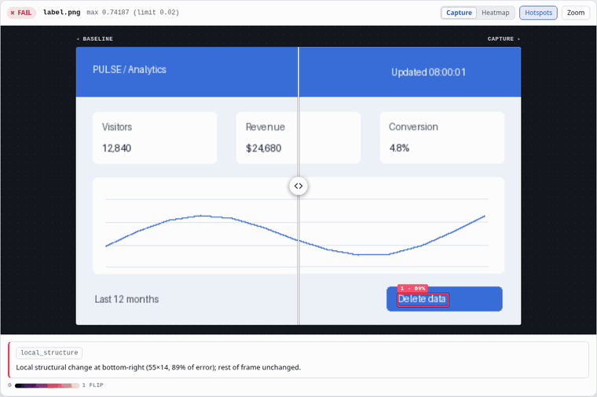<br><sub>The swipe from the showcase page, on the UI case. The HTML report has the same swipe, heatmap and hotspot views.</sub></p>

- **Scores how visible a change is.** pixelmatch, ImageMagick `compare` and RMSE count how many pixels differ, or by how much, so a 1-pixel shift of fine detail, a 1-bit dither change and a visible colour error can score alike. FLIP models how a person sees the difference (colour, contrast sensitivity, spatial frequency, viewing distance). [Reading FLIP numbers](#reading-flip-numbers) has measured examples.
- **Says where and what changed.** A CLI and a GitHub Action compare a directory of baselines with fresh captures. Each failure gets numbered hotspot boxes and a plain-English description of the change, such as a global tone shift or a local structural change. The HTML report has side by side, swipe, flicker and heatmap views; JSON and Markdown come with it. The exit code is 1 on a regression.
- **Refuses a verdict on a mismatched comparison.** Given capture metadata, a run made with a different renderer mode, resolution or driver is reported as an error, not as a pass or a fail. See [Configuration sidecars](#refuse-comparisons-made-under-different-settings).

```sh
git clone https://github.com/Tavrin/saccade && cd saccade
cargo run --release -p saccade -- compare examples/baseline examples/capture --out report
```

**[Showcase](https://tavrin.github.io/saccade/showcase/)**: eight reproducible use cases with the exact commands, images and output. Pages regenerates the gallery and reports from [`docs/showcase/`](docs/showcase). For an offline copy, run `python3 docs/showcase/build.py --out /tmp/saccade-pages/showcase` with `saccade` on PATH, then open `/tmp/saccade-pages/showcase/index.html`.

## Use cases at a glance

<table>
<tr><td width="25%" valign="top"><a href="https://tavrin.github.io/saccade/showcase/#webapp-ui">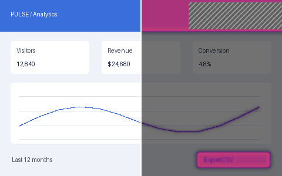</a><br><b><a href="https://tavrin.github.io/saccade/showcase/#webapp-ui">UI screenshots</a></b><br>A button label changed; the clock changes every run.</td><td width="25%" valign="top"><a href="https://tavrin.github.io/saccade/showcase/#cover-art">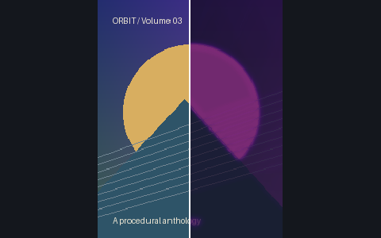</a><br><b><a href="https://tavrin.github.io/saccade/showcase/#cover-art">Cover art and assets</a></b><br>Tint, crop and JPEG quality 40, told apart.</td><td width="25%" valign="top"><a href="https://tavrin.github.io/saccade/showcase/#texture-compression">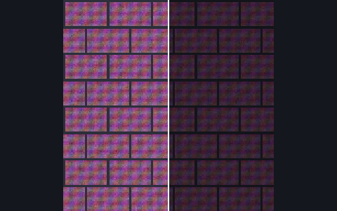</a><br><b><a href="https://tavrin.github.io/saccade/showcase/#texture-compression">Texture compression</a></b><br>Five lossy encodings ranked by visible error.</td><td width="25%" valign="top"><a href="https://tavrin.github.io/saccade/showcase/#upscaler">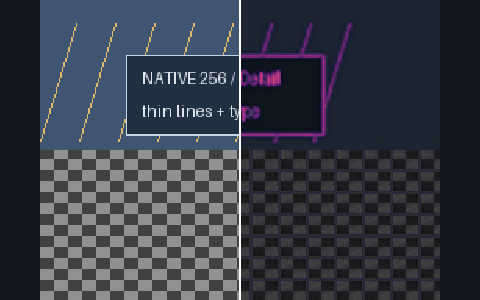</a><br><b><a href="https://tavrin.github.io/saccade/showcase/#upscaler">Upscalers and shimmer</a></b><br>Filters ranked; flicker measured over a pan.</td></tr>
<tr><td width="25%" valign="top"><a href="https://tavrin.github.io/saccade/showcase/#lod-transition">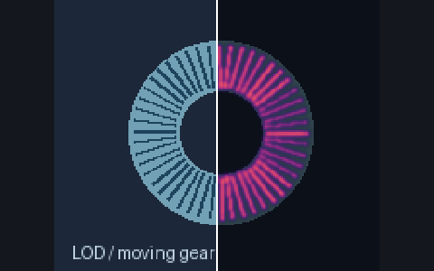</a><br><b><a href="https://tavrin.github.io/saccade/showcase/#lod-transition">LOD pops</a></b><br>One frame loses its detail. Which one?</td><td width="25%" valign="top"><a href="https://tavrin.github.io/saccade/showcase/#ml-image-model">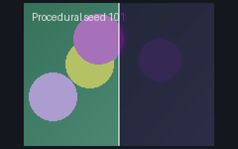</a><br><b><a href="https://tavrin.github.io/saccade/showcase/#ml-image-model">Image-model checkpoints</a></b><br>Same seeds, two checkpoints, judge-ready crops.</td><td width="25%" valign="top"><a href="https://tavrin.github.io/saccade/showcase/#render-gbuffer">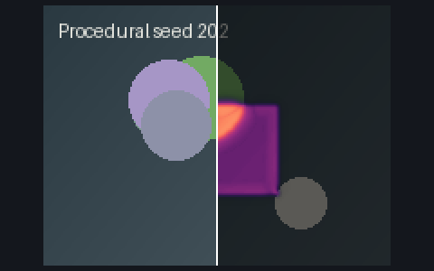</a><br><b><a href="https://tavrin.github.io/saccade/showcase/#render-gbuffer">G-buffers</a></b><br>Depth, normals and motion in their own units.</td><td width="25%" valign="top"><a href="https://tavrin.github.io/saccade/showcase/#perf-identity">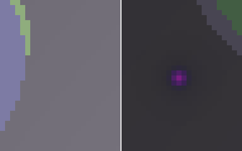</a><br><b><a href="https://tavrin.github.io/saccade/showcase/#perf-identity">Optimization identity</a></b><br>Bit-identity per image; one pixel moved.</td></tr>
</table>

The data is procedural ([`showcases/`](showcases)); `scripts/run-showcases.sh` reproduces each case's output byte for byte. Thumbnails show the baseline on the left and the capture under its FLIP heatmap on the right.

## Try it in 30 seconds

You need Rust 1.85 or newer and a C++ compiler (the build compiles NVIDIA's C++ FLIP code). The repository contains a small baseline and capture set in `examples/`.

```sh
git clone https://github.com/Tavrin/saccade
cd saccade
cargo run --release -p saccade -- demo --out saccade-demo
```

Output (the first build takes longer, since it compiles the dependencies):

```
STATUS   NAME                  METRIC  VALUE    THRESHOLD
MISSING  sphere_missing.png    mean    -        -
new      sphere_new.png        mean    -        -
FAIL     sphere_shadow.png     mean    0.05042  0.01
  ↳ 2 hotspots: 104x99 @ center (75% of error), 149x39 @ bottom-center (20%)
pass     sphere_identical.png  mean    0.00000  0.01
pass     sphere_subtle.png     mean    0.00481  0.01

1 fail, 0 error, 1 missing, 1 new, 2 pass (5 total)
```

The exit code is 1: `sphere_shadow.png` is over the threshold, and a baseline with no capture counts as a regression. Open the report. It is a self-contained report directory (`index.html` plus `images/`) and needs no server:

```sh
xdg-open saccade-demo/report/index.html     # Linux
open saccade-demo/report/index.html         # macOS
start saccade-demo\report\index.html        # Windows
```


### Report layout

The report contains `saccade-report.v1.json`, `index.html` and per-image
folders under `images/<relative name>.d/`. For example, `lit.png` gets
`images/lit.png.d/baseline.png`, `capture.png` and `heatmap.png`. JSON image
paths are relative to the report directory, so the report can be moved.
Viewer and serve-session images use the same `.d` folder suffix; explain
hotspot strips use `hotspots/<relative name>.d/`.

Every CLI command with `--out` warns on stderr if its parent directory holds
the configured metadata sidecar (`--meta-name`, default `saccade-meta.json`)
or `capture.json`: outputs there may be indexed as captures. Choose another
output location or pass `--allow-out-near-captures` to silence the warning.

Click a row to expand it. A failing image also lists its **hotspots**: numbered boxes where the error is concentrated, with their position, size, share of the total error and mean and max FLIP. The boxes are drawn over the baseline, the capture and the heatmap (the Hotspots button toggles them), and clicking a box or a row zooms the compare stage to it. A "frame-wide change" badge appears when the largest hotspot covers at least half of the frame.

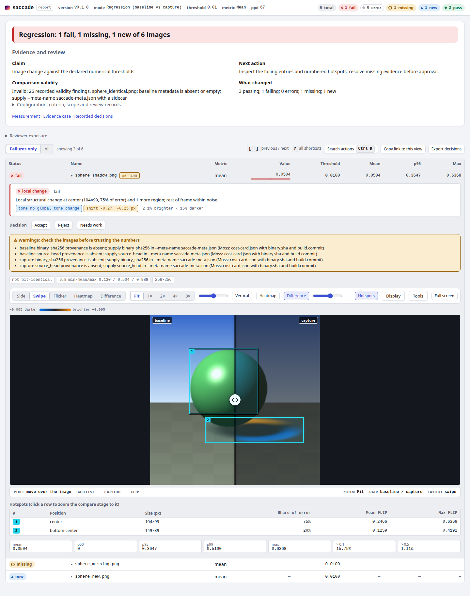

### Compare before and after

Choose Side, Swipe, Flicker, Heatmap or Difference in the comparison toolbar. Swipe has a draggable divider; Flicker alternates the images twice a second. Display holds channel, exposure, contrast and reset. Tools holds region drawing, the pixel inspector, hold-to-compare, copy link and snapshot. The status bar shows cursor coordinates, original RGB values, FLIP, zoom, pair labels and layout. Zoom and pan are shared by every layer. The same keys work in the report and in `view`; the keys act on the comparison you last touched.

| Key | Action |
|---|---|
| `←` / `→` | Move the swipe divider by 5% (with `Shift`, 1%). In `view` outside swipe, they select the previous or next image set |
| `Ctrl` / `Cmd` + `K` | Search every action in report, view, serve and runs; arrows select, Enter runs, Esc closes |
| `Space` | Toggle flicker |
| `v` | Vertical or horizontal split |
| `h` | Heatmap layer on the capture side |
| `d` | Signed difference layer in Swipe (blue darker, orange brighter) |
| `m` | Non-finite mask and cluster boxes, when present |
| `1` `2` `4` `8` | Zoom to 1×, 2×, 4× or 8× the image's pixels |
| `0` | Zoom to fit |
| `f` | Full screen (fills the screen; `Esc` leaves it) |
| `?` | Keyboard help; `Esc` closes it |
| `[` / `]` | Previous or next image set or report entry |
| `c` (hold) | Show the reference or baseline image while the key is held |

Drag on the stage to move the divider; once zoomed, drag away from the divider to pan. `Ctrl` + wheel or a pinch zooms. In `view`, `Shift`-drag (or the Region tool) draws a region of interest, and hotspot boxes are drawn from the per-pane hotspots against the reference.

The command palette uses the same action registry as keyboard shortcuts and help. Search by action or set name, including layouts, zoom, display adjustments, decisions, exports and snapshots; unavailable actions remain visible with a disabled state. Serve and runs also expose their current page controls.

Diagnostics appear above each compared entry or set: a labelled change class, its explanation, tone and shift findings, and paired timing deltas. Difference is available as a layout or a Swipe layer with a signed luminance scale. Non-finite shows NaN, infinite and negative samples with labelled cluster boxes. These controls and findings are withheld in an unrevealed blind view. RGB readings use the original display images; report FLIP readings are approximate (marked `≈`), while view readings use the stored 8-bit error map. Large view images use the existing downsampled inspector data.

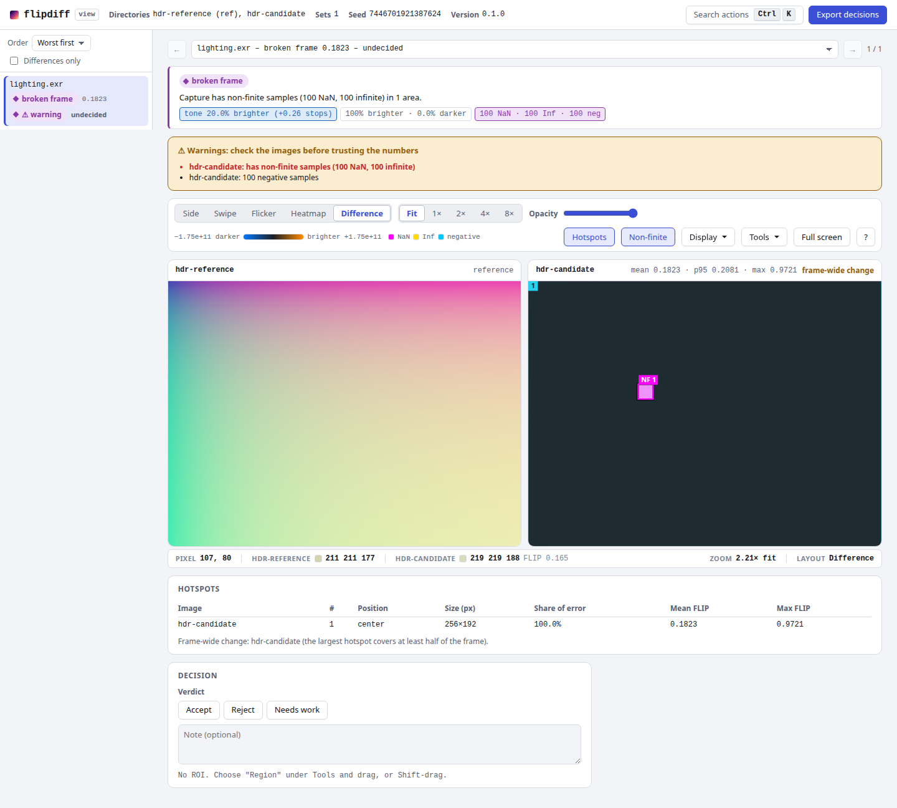

The `examples/` images are generated by `scripts/gen-examples.py`: `sphere_identical` is unchanged, `sphere_subtle` has a sub-threshold change, `sphere_shadow` has a moved light and shadow, `sphere_new` has no baseline and `sphere_missing` has no capture.

## Built for AI agents

saccade is meant to be driven by a coding agent as much as by a person. An agent that cannot open an HTML report still gets *where* and *how much* the images differ, as structured data and as small crops it can look at.

**Hotspots in JSON.** Every compared entry of the report carries `hotspots`: the regions where the FLIP error is concentrated, largest first. Each has `rect_px` and `rect_frac` (`[x, y, w, h]`), `position` (a 3x3 cell such as `bottom-center`), `area_px`, `area_frac`, `mean_flip`, `max_flip` and `share_of_total_error`. In `saccade.toml`, `hotspots` sets how many are kept per entry (default 5, 0 disables the search), `hotspot_threshold` the error above which a pixel counts (default 0.1) and `hotspot_min_share` the smallest share of the total error a hotspot must carry to be kept (default 0.01). `area_px` and `area_frac` count the hot pixels only; the box (`rect_frac`) is usually larger. The text table and the Markdown summary print the same data on one line.

**`--json` and summaries.** `compare`, `identity`, `approve`, `view` and `explain` take `--json` and print one JSON document on stdout (the reports are written to disk either way). `compare --json` and `identity --json` print a lean `saccade-result.v1`: the verdict, the totals, the failing entries (value, threshold, top-3 hotspots, the sidecar keys that differ), the report and `index.html` paths and a `next_step` sentence such as "run `saccade explain ...` and inspect the strips; approve with `saccade approve ...` if the change is intended". Floats carry 4 significant digits and paths are absolute. `--json=full` prints the whole `saccade-report.v1` instead. `saccade summary REPORT --format json` prints a compact verdict: totals, the worst failing entries with their top hotspots, and the report's file paths.

**JSON errors.** With `--json` (or `--format json`) every failure, including a command line clap rejects, prints `{"schema": "saccade-error.v1", "code": ..., "message": ...}` on stdout and exits `2`, as without `--json`. The codes are `usage`, `io`, `config`, `unsafe_path`, `not_empty_out_dir`, `nothing_compared` and `approve_mismatch`.

**Judge packs: `saccade explain`.** Turns a report into crops a vision model can read:

```sh
saccade explain report/saccade-report.v1.json --out explain
```

```
# saccade explain: 1 entry (baseline vs capture); 1 fail, 2 pass of 5
Strips are [baseline | capture | heatmap]; error scale 0 (none) to 1.

## sphere_shadow.png Fail Mean=0.0504 (limit 0.01)
frame: thumbs/sphere_shadow.png
1. center 104x99 at (59,51) 75% of error, mean 0.25 max 0.64, hot px 7580 (11.57% of frame), box 15.7% of frame: hotspots/sphere_shadow.png.d/h1.png
2. bottom-center 149x39 at (83,154) 20% of error, mean 0.13 max 0.42, hot px 2742 (4.18% of frame), box 8.9% of frame: hotspots/sphere_shadow.png.d/h2.png

pack: explain
```

The pack holds `explain.json` (schema `saccade-explain.v1`), `explain.md`, one `[baseline | capture | heatmap]` strip per hotspot (`hotspots/<name>.d/hN.png`) and a whole-frame strip with the hotspot boxes (`thumbs/<name>.png`).

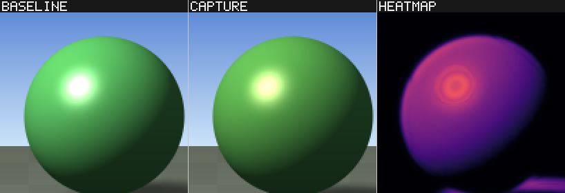

`--top N` sets the hotspots per entry, `--pad` the context around each box, `--stretch` brightens dark crops (the same gain on both images) and `--entries a.png,b.png` limits the pack and `--hotspot-min-share` (default 0.01) drops hotspots that carry less of the error. A strip is at most 1536 px wide; larger crops are scaled down. With `--blind`, each strip is `[A | B]` in a random order per hotspot, with no heatmap, and the pack names neither the report nor the sides. `--key-out PATH` is required and must lie outside `--out`, so the pack can be handed to a judge as it is (`--seed` makes the shuffle reproducible): a judge that does not know which side is the candidate cannot favour it.

**MCP server: `saccade mcp`.** A Model Context Protocol server over stdio (protocol `2025-06-18`). **Path policy:** `saccade mcp [--root DIR]` (default: the working directory) confines the agent to `DIR`. Every path it passes (inputs, `out_dir`, report and config files, the blind `key_out`) is resolved against the root and canonicalised; one that ends up outside it, through `..` or a symlink, is refused with `unsafe_path`.

| Tool | What it does |
|---|---|
| `saccade_compare` | Compares `baseline_dir` with `capture_dir` (also `threshold`, `metric`, `ppd`, `labels`, `meta_name`, `fail_on_new`, `allow_empty`, `config`, `require_matching_meta`, `declare`), writes the report and a judge pack into `out_dir`, returns a `saccade-result.v1` (verdict, the worst failing entries with their hotspots, the file paths, `next_step`) |
| `saccade_identity` | The same for `parent_dir` and `candidate_dir` with the strict identity defaults |
| `saccade_explain` | Writes a judge pack for an existing `report_json` (`top`, `hotspot_min_share`, `blind` with `key_out`) |
| `saccade_summary` | Summarises an existing `report_json` without running anything (read-only) |
| `saccade_sequence` | Compares `baseline_dir` and `capture_dir` by sorted frame index (`pattern`, run settings, `config`, HDR settings), writes to `out_dir`, returns a lean `saccade-sequence.v1` with temporal instability and report paths |
| `saccade_rank` | Ranks `candidate_dirs` against `reference_dir` (`labels`, `metric`, run settings, `config`, HDR settings), writes rankings and per-candidate reports to `out_dir`, returns a lean `saccade-rank.v1` |

Every tool declares an `outputSchema` and annotations (`destructiveHint: false`, `idempotentHint: true`, `readOnlyHint` only for the summary). `saccade_compare` and `saccade_explain` also return up to three image content blocks, the top hotspot strips downscaled to at most 1024 px wide, unless `include_images` is `false`.

Add it to Claude Code:

```sh
claude mcp add saccade -- saccade mcp
```

or to a project's `.mcp.json`:

```json
{
  "mcpServers": {
    "saccade": { "command": "saccade", "args": ["mcp"] }
  }
}
```

or to Codex, in `~/.codex/config.toml`:

```toml
[mcp_servers.saccade]
command = "saccade"
args = ["mcp"]
```

A regression is not an error: the result says `verdict: "regression"`. A failed call is a tool result with `isError: true` and `structuredContent` of schema `saccade-error.v1`, whose `code` is one of `usage` (a bad or missing argument), `unsafe_path` (a path outside the root), `io` (a path cannot be read or written, an image or report does not decode) or `config` (an invalid config file or setting). Protocol-level problems use the JSON-RPC codes `-32700`, `-32600`, `-32601` and `-32602`.

**Schemas and exit codes.** [`schemas/`](schemas) holds a JSON Schema, `schemas/saccade-<name>.v1.schema.json`, for every schema id the tools emit: `report`, `sequence`, `rank`, `decisions`, `explain`, `explain-blind-key`, `blind-key`, `explain-result`, `view-summary`, `summary`, `approve`, `result`, `decision-request`, `decide-result` and `error`. A test fails when the generated ones drift from the Rust types, and another validates real command output against them. The exit code is the verdict: `0` no regression, `1` regression (any `fail`, `error` or `missing` entry, a `new` entry with `fail_on_new`, or no pair compared at all unless `--allow-empty`), `2` usage, config or IO error (including an unsafe `--out`, see [CLI reference](#cli-reference)).

### Agent-addressable pages: the URL hash, `window.saccade` and `saccade snapshot`

The report, `view` and `serve` sessions keep their whole view in the URL hash, so a person or an agent can share or restore exactly what is on screen. The page reads the hash on load and rewrites it (`history.replaceState`, debounced) as you interact; **Copy link to this view** copies it.

```
#set=<name>&layout=side|swipe|flicker|heatmap|diff&split=0..1&vertical=0|1&zoom=fit|<n>&at=x,y
 &heat=0..1&signed=0..1&mask=0|1&channel=rgb|r|g|b|luma&ev=<float>&contrast=0.5..4&roi=x,y,w,h&hotspot=<n>
```

The report writes `entry=<name>` where the viewer writes `set=<name>`. `at` is the image-pixel centre of the zoom; `zoom` is output pixels per image pixel (`fit`, `1`, `2`, `4`, `8`, or any number up to 64); `hotspot` is the 1-based hotspot to zoom to. Unknown or invalid keys are ignored. A blind view never writes labels, the reference or `heat`/`signed`/`mask`/`hotspot` to the hash. Layouts map as follows: in the viewer `side` is "Side by side" and `heatmap` is the heatmap overlay; in the report `side` shows the three images in a row and `heatmap` shows the capture under its FLIP heatmap. `diff` selects signed difference; `signed` sets its opacity in Swipe and `mask` enables the non-finite overlay. These diagnostic layers and `contrast` are browser controls; the CLI snapshot renderer supports the layouts and controls described below.

For browser automation (Playwright, Claude in Chrome) the pages expose a stable API, `window.saccade` (version 1):

| Call | Returns |
|---|---|
| `get()` | the state object, same keys as the hash |
| `set(partial)` | a Promise that resolves with the state after the page rendered; invalid keys are ignored, never thrown on |
| `sets()` / `entries()` | `[{name, status, value}]`; a blind view gives `null` status and value |
| `next()` / `prev()` | Promise of the state after moving to the next or previous set |
| `snapshot()` | Promise of the compare stage as a PNG data URL. On `file://` the browser taints the canvas and the Promise rejects with an explanatory error; serve the directory over HTTP, or use the CLI below |
| `on('change', fn)` | subscribes to view changes; returns an unsubscribe function |
| `version` | `1` |

**`saccade snapshot`** renders a state to a PNG on the server, with no browser:

```
saccade snapshot <REPORT_JSON|VIEW_DIR> [--entry NAME] [--state 'layout=swipe&split=0.3&zoom=4&at=120,80&hotspot=1'] [--out snapshot.png] [--width 1600] [--json]
```

`side` draws the images in a row under their labels; `swipe` shows the first image on one side of a divider at `split` and the second on the other, with the FLIP heatmap over the second when `heat` is above 0; `heatmap` is the second image under its heatmap; `flicker` writes one PNG per image (`<stem>-1.png`, `<stem>-2.png`; there is no APNG). `zoom`/`at` crop, `ev` and `channel` change the display, `roi` and the hotspot boxes are drawn. Labels use a built-in bitmap font. A blind view keeps its neutral labels and draws no heatmap or hotspots. The MCP tool `saccade_snapshot` takes `{report_json | view_dir, entry, state, width}` and returns an image block (at most 1600 px wide) and the path.

### Bounded-decision models (Jev, OpenAI Decisions API, any LLM)

A bounded-decision model answers a question from a closed list of answers, with a probability. saccade asks fixed questions, hands over compact evidence and records the answer; it contains no API key and no vendor SDK. An answer from a model is a **proposal**: the pages show it as a chip ("agent proposed: accept 0.93 (jev)") that a person confirms or overrides with one click (`y` / `n`). A proposal never moves a baseline: `approve` reads final decisions only.

```
saccade decision-request report/saccade-report.v1.json --all-failing [--entry NAME] [--question accept|triage|cause|ask_human|mask_suggest] [--intent "commit message or PR text"]
saccade compare base cap --json=decision          # same, for every failing entry
saccade decide report/saccade-report.v1.json --entry NAME --answer accept --prob 0.93 --source jev [--confidence F] [--request-hash H] [--note TEXT]
echo '{"entry":"a.png","answer":"reject","prob":0.8,"source":"my-model"}' | saccade decide report/saccade-report.v1.json
```

The request is `saccade-decision-request.v1`, deterministic (the same report gives the same bytes), one item per entry with a fixed `question`, `allowed_answers`, a token-lean `state` (verdict, metrics, top-3 hotspots, frame-wide flag, black/white/NaN flags, config differences and whether they were declared, `bit_identical`, `diagnostics` class and description, your `intent`) and a `request_hash` to pass back to `decide`. MCP: `saccade_decision_request` and `saccade_decide`.

| Question | Allowed answers | Asked about |
|---|---|---|
| `accept` | `accept`, `reject`, `needs_human` | an entry: intended change or regression |
| `triage` | `noise`, `local_defect`, `global_shift`, `config_mismatch`, `broken_frame` | an entry |
| `cause` | `global_tone`, `local_structure`, `misaligned`, `noise`, `broken_frame`, `config_mismatch` | an entry |
| `ask_human` | `yes`, `no` | an entry: does a person need to look |
| `mask_suggest` | `noise_region`, `real_change` | each of the first 5 hotspots of an entry |

One request item, `accept` (state abridged):

```json
{"id": "sphere_shadow.png", "entry": "sphere_shadow.png", "question_type": "accept",
 "question": "Is this visual change intended, or a regression? Judge it against the intent text when present.",
 "allowed_answers": ["accept", "reject", "needs_human"],
 "state": {"entry": "sphere_shadow.png", "verdict": "fail", "mode": "regression", "metric": "mean", "threshold": 0.01, "value": 0.050423,
           "hotspots": [{"n": 1, "position": "center", "size": [104, 99], "share": 0.751868, "max": 0.636801, "mean": 0.246559}],
           "frame_wide": false, "meta_diff": [], "bit_identical": false, "intent": "soften the shadow",
           "diagnostics": {"class": "local_structure", "description": "Local structural change at center ..."}},
 "request_hash": "sha256:71cd3b73..."}
```

The other four have the same shape and differ in `question_type`, `question` and `allowed_answers`. `mask_suggest` items are per hotspot: `"id": "a.png#2"`, `"hotspot": 2`, with that hotspot's number in `state.hotspot`. Example answers, one JSON object per line on stdin:

```json
{"entry": "a.png", "question": "accept", "answer": "accept", "prob": 0.93, "confidence": 0.86, "source": "jev", "request_hash": "sha256:..."}
{"entry": "a.png", "question": "triage", "answer": "local_defect", "prob": 0.88, "source": "jev"}
{"entry": "a.png", "question": "cause", "answer": "misaligned", "prob": 0.71, "source": "my-model"}
{"entry": "a.png", "question": "ask_human", "answer": "yes", "prob": 0.64, "source": "my-model"}
{"entry": "a.png", "question": "mask_suggest", "hotspot": 2, "answer": "noise_region", "prob": 0.9, "source": "my-model"}
```

**Where answers go.** `decide` records into `<report_dir>/saccade-decisions.v1.json` (plus `saccade-decisions.v1.js`, which the page loads from `file://`), the same file `approve --decisions` reads. Pass a view directory, a decisions file or a `serve` session id instead of a report to record there (a session's file is in the decisions directory; the page shows the chip after a reload). Each record carries the answer, `prob`, `confidence` when the provider reports one, `source`, a timestamp, the `request_hash` it answered and `proposed: true` for every source but `human`. A new `compare` run discards the old decisions of that report directory.

**The confidence gate.** In `saccade.toml`:

```toml
[decisions]
auto_accept_min_prob = 0.95   # off when absent
allow_sources = ["jev"]       # empty: any source
gate_on = "prob"              # or "confidence"
```

Only an `accept` or `reject` answer to the `accept` question can become the set's decision, and only above the threshold, from an allowed source, on a set that has no decision yet. Otherwise it stays a proposal. **Deterministic failures are never answered by a model**: a non-finite or all-black/all-white capture, a config mismatch under `--require-matching-meta`, an identity break in `identity` mode and an `error` status are listed under `skipped` in a request and refused by `decide` (code `deterministic_failure`); a person (`--source human`) may still decide them. Session and view targets have no report to check against, so their model answers are never promoted.

**Adapters.** [`examples/adapters/`](examples/adapters) has Python scripts (standard library only) that read request files, call a provider and pipe the answers into `saccade decide`; keys come from the environment and are never printed:

| Script | Provider | Status |
|---|---|---|
| `jev_adapter.py` | Jev by TypeSafe (`JEV_API_KEY`, or `~/.config/saccade/jev.env`). Text only, batches an entry's questions into one call, passes both `probabilities[choice]` and `confidence` | verified against jev-1.13.0 on 2026-10-01 |
| `openai_decisions_adapter.py` | OpenAI Decisions API (`OPENAI_API_KEY`, `OPENAI_DECISIONS_URL`) | **UNVERIFIED**: limited preview, request schema not published; the body and reply parsing are guesses isolated in two functions |
| `llm_json_adapter.py` | any OpenAI-compatible chat model with JSON-schema constrained output (`LLM_API_KEY`, `LLM_MODEL`, `LLM_BASE_URL`) | the model's own probability is self-reported; keep the gate off or high |

```
saccade decision-request report/saccade-report.v1.json --all-failing --intent "$PR_TITLE" > accept.json
JEV_API_KEY=... examples/adapters/jev_adapter.py accept.json --target report/saccade-report.v1.json
```

## Install

Download a prebuilt archive and `SHA256SUMS` from [GitHub Releases](https://github.com/Tavrin/saccade/releases). Archives are named `saccade-<target>.tar.gz` (Linux x86_64/aarch64 and macOS arm64) or `saccade-<target>.zip` (Windows x86_64). They include the binary, README and licence notices; assets appear when a version is tagged.

Verify the downloaded archive against its line in `SHA256SUMS` before extracting it. For Linux x86_64, in the download directory:

```sh
# Save just this archive's published checksum, then verify it.
sed -n '/  saccade-x86_64-unknown-linux-gnu.tar.gz$/p' SHA256SUMS > archive.sha256
test -s archive.sha256 && sha256sum --check archive.sha256 && \
  tar -xzf saccade-x86_64-unknown-linux-gnu.tar.gz && ./saccade --version
```

On macOS use `shasum -a 256 --check archive.sha256` with the macOS asset's checksum line. On Windows use `Get-FileHash .\saccade-x86_64-pc-windows-msvc.zip -Algorithm SHA256` and compare the hash with that asset's line in `SHA256SUMS`, then extract the zip. Put the executable on PATH; retain the bundled notices with redistributed binaries. A separate `<asset>.sha256` is also published for each archive.

From source (Rust 1.85 or newer and a C++ compiler: g++, clang or MSVC):

```sh
cargo install --git https://github.com/Tavrin/saccade saccade --locked
```

A crates.io release is planned later; `cargo install saccade --locked` will be available after publication. The GitHub Action uses checksum-verified prebuilt binaries when available and otherwise builds from source.

## Use cases

### CI regression gate

Render your test scenes into a `captures/` directory, then compare against the committed baselines:

```sh
saccade compare tests/baseline captures --out saccade-report --threshold 0.01
```

With the `examples/` set this prints the table above and exits 1. In any CI system, the exit code is the gate: 0 no regression, 1 regression (including "nothing compared", for example an empty baseline directory; pass `--allow-empty` for a first run), 2 usage or IO error. In GitHub Actions, use the [action](#github-action), which also uploads the report, writes the job summary and keeps one pull-request comment up to date.

To accept a change, copy the captures over the baselines. Note the argument order: `approve` is `CAPTURE_DIR BASELINE_DIR`, the reverse of `compare`.

```sh
saccade approve captures tests/baseline --all-failing saccade-report/saccade-report.v1.json
```

```
captures/sphere_new.png -> tests/baseline/sphere_new.png
captures/sphere_shadow.png -> tests/baseline/sphere_shadow.png
```

`--all-failing` takes every `fail` and `new` entry of the report. You can also name images (`approve captures tests/baseline a.png b/c.png`) or use `--decisions` (see [human A/B review](#human-ab-review)). `--include-errors` also takes `error` entries whose capture decodes, for example a deliberate size change. `--prune-missing`, with `--all-failing`, deletes the baselines of `missing` entries whose capture is still absent, and prints each removal:

```
removed tests/baseline/sphere_missing.png
```

`approve` deletes only files inside the baseline directory and refuses to write through a symlink there.

### Identity proof for an optimization

A renderer optimization should not change the output. Render the same scenes with the parent build and the candidate build, then:

```sh
saccade identity parent-captures candidate-captures --out identity-report
```

```
identity: ✅ 4/4 bit-identical

STATUS  NAME                  METRIC  VALUE    THRESHOLD
pass    sphere_identical.png  max     0.00000  0
pass    sphere_missing.png    max     0.00000  0
pass    sphere_shadow.png     max     0.00000  0
pass    sphere_subtle.png     max     0.00000  0

0 fail, 0 error, 0 missing, 0 new, 4 pass (4 total)
```

The defaults are strict: metric `max`, threshold 0. Each pair reports `bit_identical`: the decoded samples are exactly equal, at native depth, including alpha, 16-bit values and HDR NaN and negative values. A pair passes if it is bit-identical or its value is within `--threshold`. When pairs differ, the headline says how much, for example ``identity: ❌ 2 differ (max FLIP 0.637 on `sphere_shadow.png`), 1 missing, 1 new``. Use `--threshold 0.01` for a change that may differ slightly, and `--labels parent,candidate` to rename the two sides in the report.

`identity` ignores `[[override]]` tables from an auto-loaded `./saccade.toml` and prints a notice saying so. It applies them only when you pass `--config` explicitly. Regions, masks and `[hdr]` settings are always applied.

### Human A/B review

`view` is for deciding between images: accepting a re-baseline, choosing between candidate renders, look-dev review. It needs no threshold and no CI. It takes 2 to 6 directories, paired by relative path, and writes a self-contained directory (`index.html` plus `images/`) that needs no server.

```sh
saccade view examples/baseline examples/capture --labels baseline,capture --out view
xdg-open view/index.html
```

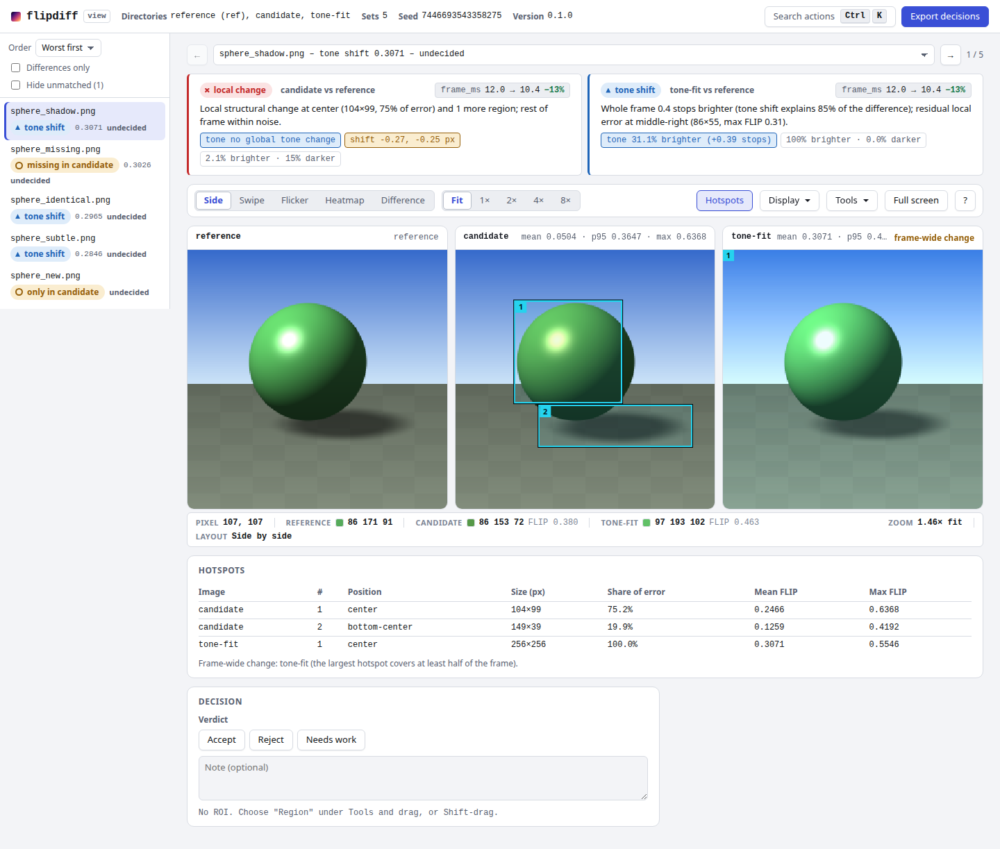

The viewer has side-by-side, swipe, flicker and heatmap layouts; synchronised zoom and pan; a pixel inspector (RGB of every pane and the FLIP value; its pixel data loads only when you first inspect a set, and is capped at 2048 px on the long side, with an "inspector at 1/N res" note when a pane is larger); exposure and contrast sliders and channel isolation for dark frames; and a region tool that reports mean FLIP and mean RGB inside a rectangle. `--reference DIR` picks the FLIP reference (the first directory by default). `--config saccade.toml` shows its `[[region]]` tables as preset rectangles. `--ppd` sets the viewing condition.

The set list is a triage list: each set shows a status chip (differs, identical, missing, error) and its worst mean FLIP, ordered worst first by default (or by name or status), with a "Differences only" filter. The viewer opens on the worst set. When the sidecars of the directories differ, a warning above the images lists the differing keys, because the comparison may not be like for like.

For each image set the reviewer chooses Accept, Reject or Needs work and may add a note. "Export decisions" downloads `saccade-decisions.v1.json` (format in [docs/design.md](docs/design.md#81-decisions)). Feed it to `approve` to promote the accepted captures:

```sh
saccade approve captures tests/baseline --decisions saccade-decisions.v1.json
```

**Blind mode.** `--blind` hides which directory is which, for unbiased A/B judging:

```sh
saccade view examples/baseline examples/capture --blind --out view-blind --key-out blind-key.json
```

```
wrote view-blind/index.html (5 image sets, 2 directories)
blind key (keep it away from the judge): blind-key.json
```

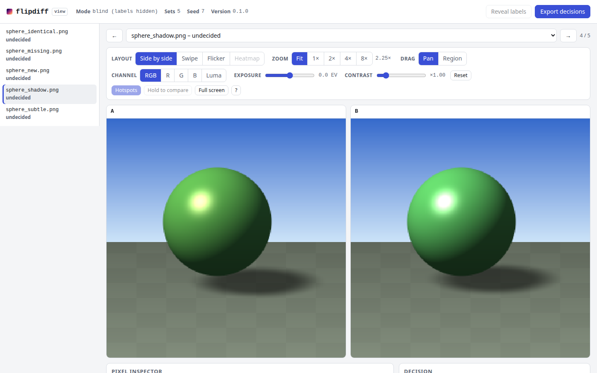

Each image set is laid out in its own random order, so the position of a pane says nothing about its directory. The page embeds only neutral labels (`P1`, `P2`, by position within the set), random image file names (`images/<name>.d/p_<hex>.png`), no reference index, no per-set order, no shuffle seed (a random token pairs the page with its key) and no FLIP data at all: no heatmaps, metrics, hotspots or error maps, because those would single out the reference directory. So view-source reveals nothing, and a test greps the page and the explain pack for the directory names and labels. The true labels are in the key file, which the page does not reference: `--key-out PATH` puts it somewhere else (by default it is `blind-key.json` inside `--out`, which then must not be handed to the judge). After the judge has decided every set, "Reveal labels" asks for that file, or you convert the exported decisions yourself:

```sh
saccade unblind saccade-decisions.v1.json blind-key.json --out decisions-true-labels.json
```

### Browse and compare runs: `saccade serve`

`serve` is a local web app for an archive of captures: a directory tree whose leaves are directories of images (one per run, nightly build or release). It lists the runs with their thumbnails and sidecar metadata, searches them, and opens the `view` page on any 2 to 6 of them.

```sh
saccade serve archive --open
```

```
saccade serve: http://127.0.0.1:7878/
  cache:     ~/.cache/saccade
  decisions: ~/.local/share/saccade/decisions
  (Ctrl-C to stop)
```

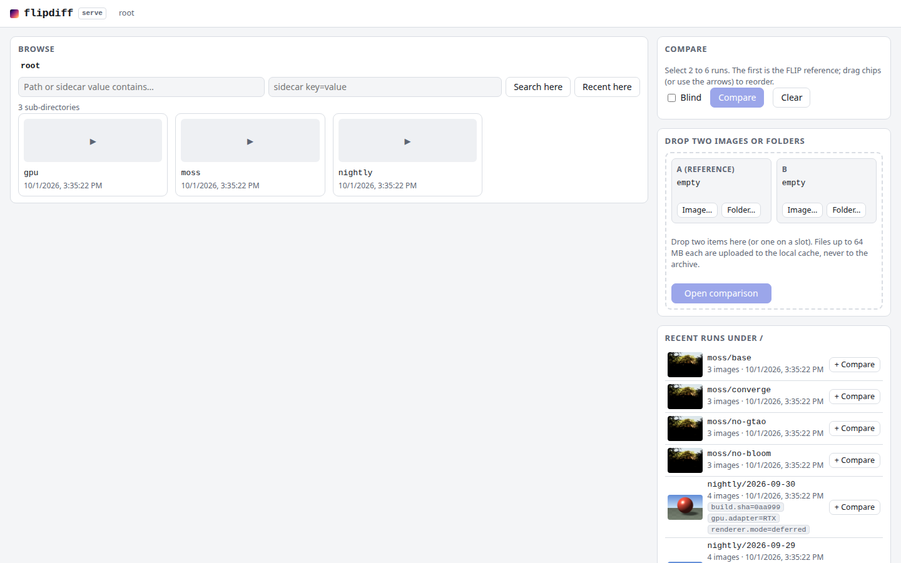

The comparison page opens on the worst set and has a "← Browse" link back to the runs' parent directory. The free-text search matches the run path and any sidecar key or value. Browse into a directory, press "+ Compare" on two or more runs (the first is the FLIP reference; drag to reorder) and press Compare. "Recent runs" lists the most recently modified runs under the current directory. Each shows at most three sidecar chips: the keys whose value differs among the listed runs, long values shortened (the full value is in the tooltip) and the rest behind "+N". A chip filters the search by that key. You can also drop two images or folders on the page to compare them (uploads go to the cache, never to the archive).

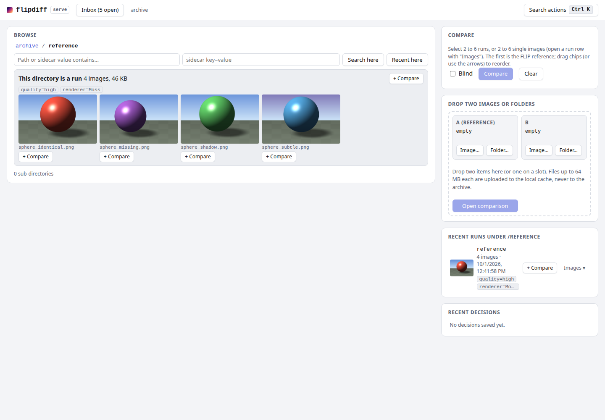

**Run overview.** Pressing Compare on two or more runs (blind off) opens the run overview first, `/runs?ref=<run>&run=<a>&run=<b>` (the first selected run is the reference). It shows, once at the top, the run-level sidecar keys that differ; one card per run with `N identical · N changed (worst lit.png 0.645) · N only-in-ref · N only-in-run · config differs: K keys`; a matrix of images by runs; and a contact sheet with one swipe slider (left and right arrow keys) shared by every image. A run whose images are all bit-identical to the reference's, with none missing or extra, is flagged "No visible effect: this run changed nothing", which is what an ablation arm that turned out to do nothing looks like. Matrix cells are thumbnails tinted by mean FLIP from green to red, "=" for bit-identical and a dash for absent; hover shows the FLIP heatmap and values, click opens the viewer on that image and pair. FLIP is measured in a background thread, pair by pair, with progress shown, and cached in the cache directory (`runs/`), so reopening is instant. A session links back with "Run overview".

When the runs share few or no file names ("0 of 9 file names match"), the card says so and offers **Pair by position** (sorted order) or **Pair manually** (drag a run image onto a reference image, or pick it from a list). The pairing is in the URL (`pair<i>=position` or `manual:<ref index>-<run index>,...`, the reference being 0).

`saccade runs REF_DIR RUN_DIR... [--json] [--out DIR]` writes the same overview as a static page (`index.html`, thumbnails, `saccade-runs.v1.json`; default `runs/`), or prints `saccade-runs.v1` JSON with `--json` ([schema](schemas/saccade-runs.v1.schema.json)); `--pair-by-position` pairs unlike names. `GET /api/runs?ref=...&runs=...` returns the same JSON from the server (poll until `progress.complete`), and the MCP tool `saccade_compare_runs` returns the matrix summary (read-only, paths under the root).

**Single images, several roots, symlinks.** A run row's "Images" button lists its images, each with its own "+ Compare": any 2 to 6 single images from anywhere under the root can be compared (a selection holds runs or images, not both). `saccade serve rootA rootB ...` serves several roots, each a top-level entry named after its directory (paths then start with that name, for example `rootA/nightly/2026-09-27`). `--follow-symlinks-within-roots` lets a symlink that resolves inside any of the roots be browsed and served; a symlink to anywhere else stays refused. Without it, a symlink may still point inside its own root. External capture storage is allowed explicitly with repeatable `--symlink-target DIR`.

#### Deep links for dashboards

Use repeated `run=` parameters and percent-encode each complete path. A comma
in a directory name stays part of that path: `nightly/build,fast` becomes
`nightly%2Fbuild%2Cfast`. The legacy `runs=a,b` form still works when no `run=`
parameter is present; its commas are separators after decoding.

| Form | Destination | Example |
| --- | --- | --- |
| `/run?path=<rel>` | One run: cached thumbnails, metadata and compare-tray actions | `/run?path=nightly%2Fbuild%2Cfast` |
| `/compare?run=<rel>&run=<rel>` | Viewer for 2–6 runs or images; one run redirects to `/run` | `/compare?run=nightly%2Fbuild%2Cfast&run=nightly%2Fbaseline` |
| `/runs?ref=<rel>&run=<rel>[&run=...]` | Overview of 1–6 runs against a reference | `/runs?ref=baseline&run=nightly%2Fbuild%2Cfast` |
| `/open?abs=<absolute>[&abs=...][&ref=<absolute>]` | Resolve absolute archive paths and redirect to `/run`, `/compare` or `/runs` | `/open?abs=%2Fcaptures%2Fbuild%2Cfast&abs=%2Fcaptures%2Fbaseline` |
| `/image?path=<rel>` | Single image in the shared viewer with one pane | `/image?path=nightly%2Fbuild%2Cfast%2Flit.png` |
| `/pair?a=<rel>&b=<rel>` | Two images in the viewer | `/pair?a=build%2Flit.png&b=baseline%2Flit.png` |
| `/api/roots` | JSON array of `{name, path}` for dashboard mapping | `[{"name":"captures","path":"/mnt/captures"},{"name":"captures-2","path":"/nas/captures"}]` |

With one root, relative paths have no root prefix and `/api/roots` returns
`name: ""`. With several roots, the first segment is the root directory's
basename. Duplicate names gain `-2`, `-3`, etc. in command-line order (skipping
names already assigned). `/open` builds these prefixes for the dashboard.
One image passed to `/open` opens `/image`; two images open `/pair`.
`labels=` and `blind=1` are preserved by `/open` redirects and used by the
comparison viewer. Missing paths and paths outside the roots return the same
styled 404 with a link back to the archive.

For symlinked captures on network storage:

```sh
saccade serve /captures --symlink-target /mnt/nas/captures --fs-timeout-ms 3000
# /captures/run may link to /mnt/nas/captures/run
# Open the lexical archive path, not the NAS target itself:
curl -i 'http://127.0.0.1:7878/open?abs=%2Fcaptures%2Frun'
```

The unresolved path must be inside a served root and contain no `..` before
it is resolved. The resolved target must stay inside its root, inside another
served root with `--follow-symlinks-within-roots`, or inside an explicit
`--symlink-target`. This rule applies to browsing, metadata, sessions,
thumbnails and images. `symlink_targets = ["/mnt/nas/captures"]` and
`fs_timeout_ms = 3000` may also be set in `saccade.toml`; relative config targets
are based on that file's directory. CLI targets extend the config allowlist,
and the CLI timeout overrides the config. Storage probes run in helper threads
with a bounded channel and a default 3-second deadline. At most eight probes
can remain active, including timed-out operations; a timeout or saturation
returns a styled 503 naming only the root-relative path. Comparison inputs are
copied into the local cache before background work starts.

**Security model.** The server binds `127.0.0.1` only, with no option to change that. It rejects any request whose `Host` is not `127.0.0.1:<port>` or `localhost:<port>` (DNS-rebinding defence), and every write needs a matching `Origin` and a per-process random token. Client paths are relative to the archive root (or start with a root's name when there are several), canonicalised, and must stay inside the root they were reached from (inside any root with `--follow-symlinks-within-roots`): no `..`; `/open` accepts absolute paths only after lexical containment, and explicitly allowed external symlink targets follow the same checks. Only image files are served. The archive is read-only.

**Where things go.** Sessions, thumbnails, pair staging and uploads go to the cache directory (`--cache-dir`, default `$XDG_CACHE_HOME/saccade`, i.e. `~/.cache/saccade`). The decisions you make in the viewer (accept, reject, needs work, notes, regions) are saved as `saccade-decisions.v1.json` files in the decisions directory (`--decisions-dir`, default `$XDG_DATA_HOME/saccade/decisions`) and listed under "Recent decisions"; feed one to `saccade approve --decisions`. `--config`, `--ppd`, `--meta-name`, `--meta-ignore` and the HDR flags behave as in `view`.

### Refuse comparisons made under different settings

Two captures can differ because the configuration differed, not because the code did. A capture preset can silently inject a renderer mode nobody chose, and an "A versus B" performance or quality comparison then measures the preset. saccade can read a small JSON file that describes how each directory of captures was made, and refuse to call a comparison when the two sides differ in a setting nobody declared.

Write a flat JSON file named `saccade-meta.json` into each capture directory (the name is configurable):

```json
{
  "renderer.mode": "forward",
  "resolution.internal": "1920x1080",
  "gpu.adapter": "adapter-name",
  "run.id": "a-0192"
}
```

```sh
saccade identity parent-captures candidate-captures --require-matching-meta
```

If `renderer.mode` is `forward` in one directory and `deferred` in the other:

```
identity: ❌ 3 error

STATUS  NAME                  METRIC  VALUE  THRESHOLD
ERROR   sphere_identical.png (configuration differs on undeclared keys: renderer.mode (declare them with --declare to accept)) [config differs: renderer.mode]  max  -  -
...
0 fail, 3 error, 0 missing, 0 new, 0 pass (3 total)
```

The exit code is 1. Each affected entry becomes an `error` (its metrics are kept in the report). Declare the keys that are expected to differ and the run gives a verdict again, still showing the difference:

```sh
saccade identity parent-captures candidate-captures --require-matching-meta --declare renderer.mode
```

```
identity: ✅ 3/3 bit-identical

STATUS  NAME                                                  METRIC  VALUE    THRESHOLD
pass    sphere_identical.png [config differs: renderer.mode]  max     0.00000  0
...
```

Rules:

- Without `--require-matching-meta`, differences are only shown, and do not change a verdict: a `config differs` badge and a key table in the HTML report, a `⚠ config differs on N images: ...` line in the Markdown summary, a `↳ config differs: ...` line in the text table, and a card per image set in `view`.
- **Lookup.** Sidecars from the root of the directory down to the image's folder merge, and the nearer one wins on a conflicting key. A per-image `<stem>.saccade-meta.json` overrides all of them.
- **Format.** A flat JSON object whose values are strings, numbers, booleans or null. Use dot-namespaced keys (`renderer.mode`, `env.SOME_VAR`, `binary.sha`, `warmup_frames`). A nested value makes the entry an `error` that names the key. A sidecar that is a symlink, or larger than 1 MiB, is refused.
- **Ignored keys.** Keys that match `*timestamp*`, `*_ms`, `*duration*`, `*elapsed*`, `run.id`, `*.started_at`, `*.finished_at` or `generated_at*` (case-insensitive) are never compared, and a bare `*time*` is deliberately not among them (it would hide `timezone` or `timeout`). `--meta-ignore GLOB,...` adds more. Every ignored key that differs is still listed per entry as `meta_ignored_diff` in the report, so an ignore glob cannot hide a change unnoticed.
- **Declared keys.** `--declare KEY|GLOB,...` names the keys allowed to differ when `--require-matching-meta` is set.
- A sidecar on one side only shows every key of the other as `<absent>`.
- `--meta-name NAME` (or `meta_name` in `saccade.toml`) changes the file name, for example `--meta-name cost-card.json` to adopt a file your pipeline already writes. `compare` and `identity` take all four flags; `view` takes `--meta-name` and `--meta-ignore`, and in `--blind` mode it hides the difference from the judge.

The report records the differences in each entry's `meta_diff` and the settings in `config.meta` ([docs/design.md](docs/design.md#9-metadata-sidecars)).

### HDR and EXR captures

`.exr` and `.hdr` (Radiance) files are paired like PNGs and compared with HDR-FLIP: both images are tone-mapped at several exposures, FLIP runs on each, and the per-pixel maximum is kept. A change in a highlight that is clipped in an 8-bit capture is visible this way.

```sh
saccade compare hdr-baseline hdr-capture --out hdr-report --hdr-tonemapper aces
```

```
STATUS  NAME        METRIC  VALUE    THRESHOLD
FAIL    sphere.hdr  mean    0.04625  0.01
pass    same.hdr    mean    0.00000  0.01

1 fail, 0 error, 0 missing, 0 new, 1 pass (2 total)
```

(`sphere.hdr` here is the `examples/` sphere with its highlight at 20 times and at 8 times the linear intensity; `examples/` does not ship HDR files.)

Settings: `--hdr-tonemapper aces|hable|reinhard` and `--hdr-exposures START:STOP:N` (start and stop in stops; write `--hdr-exposures=-4:2:8` with an equals sign when START is negative). Without them the exposure range is computed from the baseline image. The same settings are in the `[hdr]` config table, and the values used are recorded in each entry's `hdr` field. An HDR and an LDR image cannot be compared (`error` entry). In the report and the viewer, HDR images are shown as PNGs tone-mapped at exposure 0, and the original is copied next to them as `images/<name>.d/baseline.orig.exr`. The method and its approximation are in [Limits](#limits) and [docs/design.md](docs/design.md#35-hdr-flip).

### Regions and masks

A whole-frame mean hides a local change, and some areas are noise you do not want to judge. `[[region]]` names an area that matters, and `[[mask]]` removes an area from the statistics. Both take rectangles as fractions of the frame (`[x, y, w, h]`, so a resolution change keeps their meaning). A mask can also be an image.

`examples/` contains no config, so this `saccade.toml` is written for it: it judges the shadow area of `sphere_shadow.png` on its own and masks the sky (the top 40 percent) in every `sphere_*` image.

```toml
[[region]]
name = "ground-shadow"
glob = "sphere_shadow.png"
rect = [0.25, 0.55, 0.60, 0.35]
threshold = 0.05
metric = "p95"

[[mask]]
glob = "sphere_*"
rect = [0.0, 0.0, 1.0, 0.40]
```

```sh
saccade compare examples/baseline examples/capture --config saccade.toml --out report
```

```
STATUS   NAME                  METRIC  VALUE    THRESHOLD
MISSING  sphere_missing.png    mean    -        -
new      sphere_new.png        mean    -        -
FAIL     sphere_shadow.png     mean    0.04153  0.01
pass     sphere_identical.png  mean    0.00000  0.01
pass     sphere_subtle.png     mean    0.00487  0.01

1 fail, 0 error, 1 missing, 1 new, 2 pass (5 total)
```

`sphere_shadow.png` drops from 0.05042 to 0.04153 and `sphere_subtle.png` moves from 0.00481 to 0.00487, because the masked sky pixels leave the mean. The failing region gets its own row in the Markdown summary (`sphere_shadow.png › ground-shadow`, p95 0.313 against 0.05).

- Masked pixels are excluded from every statistic. `masked_fraction` records how much was excluded, and the heatmap shows masked pixels as a grey hatch.
- **A mask is not a switch that makes an area invisible.** FLIP filters the whole image before the statistics are taken, so a change inside a mask raises error values in the unmasked pixels next to it. Leave a margin around the area you want to ignore.
- A region without a `threshold` is informational. A region with no unmasked pixel has value `null`. A mask that covers the whole image makes the entry an `error`.
- An image mask (`image = "masks/foliage.png"`) is white = exclude, resized to the frame with nearest-neighbour sampling. Its path is relative to the config file and must not be absolute or contain `..`.
- A `[[region]]` or `[[mask]]` glob that matches no image prints a warning, so a typo does not silently disable it.

## Reading FLIP numbers

FLIP gives each pixel an error between 0 (no visible difference) and 1. saccade reports statistics of that map: `mean`, `p50`, `p95`, `p99` and `max`. The table shows what some changes score. The base image is `examples/baseline/sphere_identical.png` (256x256), and the variants were generated for this table, except the last two rows, which are in `examples/`.

| Change to the image | mean | p95 | max |
|---|---:|---:|---:|
| none (identical) | 0.0000 | 0.0000 | 0.0000 |
| `examples/` `sphere_subtle`: sub-threshold change | 0.0048 | 0.0102 | 0.0225 |
| random +-1 on every channel of every pixel | 0.0139 | 0.0246 | 0.0462 |
| random +-4 on every channel of every pixel | 0.0322 | 0.0568 | 0.1020 |
| whole image shifted 1 px | 0.0215 | 0.1012 | 0.6830 |
| whole image shifted 4 px | 0.0568 | 0.2979 | 0.9784 |
| one 24x24 px magenta block | 0.0120 | 0.0000 | 0.9677 |
| red +6, blue -6 on every pixel | 0.1123 | 0.1464 | 0.1756 |
| all pixels 10 percent brighter | 0.2460 | 0.3374 | 0.4536 |
| red +20, blue -20 on every pixel | 0.2677 | 0.3394 | 0.4024 |
| `examples/` `sphere_shadow`: light and shadow moved | 0.0504 | 0.3647 | 0.6368 |

What the table shows:

- FLIP is not proportional to the size of the pixel change. A 1-px shift of the whole frame scores a mean of 0.02 but a max of 0.68, because only edges change. A uniform tint of 6 out of 255 scores a mean of 0.11, more than a visibly moved shadow, because large flat areas are where the eye is most sensitive to a colour shift.
- Different statistics answer different questions. The magenta block changes 1 percent of the frame: the mean is 0.012, p95 is 0, and the max is 0.97. `mean` reflects overall drift, `p95` reflects a change that covers more than 5 percent of the frame, and `max` reacts to a single bad pixel.
- A value of 0.05 on `mean` is not "5 percent different". For `sphere_shadow` it means 16 percent of the pixels have an error above 0.1 and 1 percent above 0.5 (`frac_above_0_1`, `frac_above_0_5` in the JSON report), and a person flickering between the two images sees the change at once.

**Choosing a threshold.** Do not pick one from the table. Measure the noise of your own pipeline: capture the same build twice (or on two runs of CI), compare the captures, and read the largest value of the metric you plan to use. Set the threshold at two to three times that, then check that a change you consider a real regression is above it. The default, 0.01 on `mean`, passes a +-1 dither and fails a visible shift of a large area.

**Choosing a metric.**

| Metric | Use it when | Weak at |
|---|---|---|
| `mean` (default) | You want to catch broad drift: exposure, tone mapping, colour, a changed look | A small local defect: a 24x24 block in a 256x256 frame scores 0.012 |
| `p95` | You want to catch a change that covers a noticeable part of the frame (more than 5 percent) while ignoring a few noisy pixels | A defect smaller than 5 percent of the frame |
| `max` | Output should be deterministic and any visible local defect matters (identity proofs, same GPU and driver) | Noisy captures: one flickering edge pixel can fail it |

Set a different metric and threshold per scene with `[[override]]`, and use `[[region]]` to judge a small important area on its own.

`--ppd` (pixels per degree, default 67) sets the viewing condition: 67 is FLIP's default, a 4K monitor about 0.7 m wide viewed from 0.7 m. A higher value models a farther viewer or denser display, and fine detail counts for less.

## Baselines per GPU, driver and platform

Different GPUs, drivers and operating systems produce different pixels for the same scene (rasteriser rules, filtering, precision, denormals). One baseline set cannot serve all of them without a threshold loose enough to hide real regressions. The pattern:

1. Keep one baseline directory per hardware class, named for what produces the difference:

   ```
   tests/baseline/
     nvidia-linux/
       scene_a.png
       scene_b.png
     intel-mesa-linux/
       scene_a.png
       scene_b.png
     apple-m-macos/
       scene_a.png
       scene_b.png
   ```

2. Run the comparison once per class, each with its own baseline directory, report directory, artifact name and comment key. With the Action, a matrix does this:

   ```yaml
   jobs:
     visual:
       strategy:
         fail-fast: false
         matrix:
           include:
             - { name: nvidia-linux,     runner: [self-hosted, linux, nvidia] }
             - { name: intel-mesa-linux, runner: [self-hosted, linux, intel] }
             - { name: apple-m-macos,    runner: macos-14 }
       runs-on: ${{ matrix.runner }}
       steps:
         - uses: actions/checkout@v4
         - run: ./render-tests.sh --out captures/
         - uses: Tavrin/saccade@main
           with:
             baseline-dir: tests/baseline/${{ matrix.name }}
             capture-dir: captures
             report-dir: saccade-report-${{ matrix.name }}
             artifact-name: saccade-report-${{ matrix.name }}
             comment-key: ${{ matrix.name }}
   ```

   `upload-artifact` v4 rejects two artifacts with the same name, and without a `comment-key` every job would overwrite the same pull-request comment.

3. Pick the metric by how reproducible the class is:
   - **Same GPU, driver and OS as the baseline, deterministic renderer:** use `max` with a small threshold (or `saccade identity` for optimizations). Any local defect shows up.
   - **Same hardware class but driver updates, or a renderer with temporal noise:** use `mean` or `p95` with a threshold above the noise you measured (see [choosing a threshold](#reading-flip-numbers)), and add `[[region]]` tables with their own thresholds for the areas that must not move.
   - **Software rasteriser (for example llvmpipe or WARP) in CI:** treat it as its own class, with its own baselines. It is deterministic, so `max` works, but its output differs from real GPUs.

4. When a driver or runner image changes the output of a class, re-baseline that class only, with `saccade approve`.

## GitHub Action

```yaml
on: pull_request
jobs:
  visual:
    runs-on: ubuntu-latest
    steps:
      - uses: actions/checkout@v4
      - run: ./render-tests.sh --out captures/   # your renderer
      - uses: Tavrin/saccade@main
        with:
          baseline-dir: tests/baseline
          capture-dir: captures
```

The action installs a prebuilt `saccade-<target>.tar.gz` (`.zip` on Windows) from the GitHub release for the requested ref, checks it against the `.sha256` file published next to it and runs `saccade --version`. If there is no matching release asset, the checksum is missing or wrong, or the binary does not run, it falls back to `cargo install --git`, which needs Rust on the runner (GitHub-hosted runners have it) and a C++ compiler. It then runs `compare`, uploads the report directory as an artifact, writes the summary to the job summary, updates one pull-request comment (found by the `<!-- saccade-summary -->` marker), and fails the job with the exit code of `compare`. It runs `compare` only; `identity` and `view` are CLI commands.

The workflow that uses the action must be able to see this repository: it must be public, or, if it is private or internal, the repository's Actions settings must grant access to the repositories that use it.

**Inputs**

| Input | Default | Meaning |
|---|---|---|
| `baseline-dir` | required | Directory of committed baseline images |
| `capture-dir` | required | Directory of freshly captured images |
| `threshold` | empty | Default pass threshold. Empty uses `saccade.toml`, then 0.01 |
| `metric` | empty | `mean`, `p95` or `max`. Empty uses `saccade.toml`, then `mean` |
| `config` | empty | Path to a `saccade.toml`. Empty uses `./saccade.toml` if it exists |
| `report-dir` | `saccade-report` | Output directory, relative to the workspace. An absolute path is compared and summarised but not uploaded as an artifact |
| `artifact-name` | `saccade-report` | Name of the uploaded artifact. Matrix jobs need distinct names |
| `comment-key` | empty | Makes the pull-request comment unique (marker `<!-- saccade-summary:<key> -->`). ASCII letters, digits, `.`, `_`, `-`; at most 64 characters |
| `fail-on-new` | `false` | A capture without a baseline counts as a regression |
| `comment` | `true` | Create or update one pull-request comment (`pull_request` events only) |
| `update-baselines` | `false` | On trusted `workflow_dispatch` runs, approve failing/new captures and open a baseline-update PR |
| `update-branch-prefix` | `saccade/update-baselines` | Update branch prefix; the run ID is appended with a hyphen |
| `update-prune-missing` | `false` | Explicitly opt into removing missing baselines during an update |
| `github-token` | `github.token` | Used for the comment and for downloading the release asset |
| `version` | the action's own ref | Git ref (tag, branch or commit) of this repository to install |

**Outputs**

| Output | Meaning |
|---|---|
| `exit-code` | Exit code of `saccade compare`: 0, 1 or 2 |
| `failed` | Number of failed images |
| `new` | Number of captures without a baseline |
| `report-dir` | The report directory |

The comment needs `pull-requests: write` on the token. On pull requests from forks the token is read-only: the comment step prints a warning and the job result is unaffected. The comment links to the report artifact. It does not embed images; see [Roadmap](#roadmap).

`.github/workflows/example-usage.yml` runs the action on `examples/` by hand (`workflow_dispatch`). The examples contain a deliberate regression, so that run fails.

### Baseline-update pull requests

Set `update-baselines: 'true'` in a `workflow_dispatch` workflow with
`permissions: { contents: write, pull-requests: write }`. The checkout credentials
need contents write access, and `github-token` needs pull-request write access.
The action runs `saccade approve CAPTURE BASELINE --all-failing REPORT`, stages
only the files approve copied or pruned, commits on
`saccade/update-baselines-<run_id>`, pushes and opens a PR. Its body contains the
Markdown comparison summary and the uploaded report artifact link. No changed
baselines means no branch or PR. `update-prune-missing: 'true'` adds
`--prune-missing`; deletion is off by default.

Updates require a clean tracked checkout, a baseline directory inside that
checkout, a dispatch on a branch, a successful report upload and a comparison
that completed (exit 0 or 1). They never run on fork pull requests or other
events. Permission failures fail the step. The action still returns the original
comparison exit code, so a regression run can open an update PR and finish red.
See [example-update-baselines.yml](.github/workflows/example-update-baselines.yml)
for a dispatch-only workflow. PR comment commands are not required.

## Frame sequences: temporal stability

Use sequences to compare TAA or upscaler changes across a moving scene:

```sh
saccade sequence baseline-frames capture-frames --pattern 'frame_*.png' --out sequence-report
```

Each directory is one sequence of numbered colour frames. The trailing integer
before the extension sets the numeric order (`frame_2` precedes `frame_10`).
Frames pair by sorted index, so numbering may start at different values on the
two sides. Duplicate numbers and matching files without a trailing number are
configuration errors. Extra baseline/capture frames are missing/new entries.

`saccade-sequence.v1.json` records the per-frame mean FLIP curve, worst frame,
frames over their deciding threshold, and **temporal instability**: mean FLIP
between consecutive capture frames minus the same mean for the baseline.
A positive value means the change added variation; a negative value means it
removed variation. This is a difference of whole-frame temporal FLIP means,
not motion compensation. With fewer than two frames on either side, instability
is null; a temporal decode/size error is reported and fails the run. The metric
is informational: the exit verdict uses the per-frame compare rules and temporal
errors. `--threshold`, `--metric`, `--ppd`, `--config`, labels, metadata and HDR
settings work as for compare. The HTML report reuses the per-frame comparison
table and adds a server-generated SVG curve. `--json` prints a lean summary;
`--json=full` includes the curve and entries.

## Non-colour buffers: G-buffer checks

Declare buffer meanings in `saccade.toml`, then use `saccade compare` as usual:

```toml
[[buffer]]
glob = '**/depth.png'
kind = 'depth'
encoding = 'linear01'
threshold = 0.001

[[buffer]]
glob = '**/normal.png'
kind = 'normal'
encoding = 'rgb_snorm'
threshold = 1.0                 # degrees

[[buffer]]
glob = '**/motion.png'
kind = 'motion'
encoding = 'rg_snorm'
scale = 64.0                    # signed unit -> pixels, per component
threshold = 0.5                 # pixels

[[buffer]]
glob = '**/id.png'
kind = 'id'                     # or 'mask'
encoding = 'exact'
threshold = 0.0                 # allowed changed-pixel fraction
```

The first matching buffer rule wins. These pairs use numerical errors and never
FLIP. Depth preserves image precision and reports absolute and relative errors;
`reverse_z` decodes `1-R`, and `r32f` reads the EXR R channel, including
single-channel EXRs. Normal error is the angle between decoded, normalised
vectors (`rgb_snorm`: RGB × 2 − 1; `oct` uses octahedral RG). Motion error is
the Euclidean end-point distance between RG × 2 − 1 vectors, multiplied by
`scale`. Mask/id compare every native sample, including alpha and 16-bit values,
and report exact-match fraction and changed-pixel count.

Depth/normal/motion accept `metric = 'mean'|'p95'|'p99'|'max'` (default mean).
Mask/id always decide on changed fraction. Default limits are 0.01 depth units,
1 degree, 0.5 pixels, and zero changed fraction. Encodings default to those shown
above. Each compared entry has `buffer` (kind, encoding, units, value, threshold,
stats, heatmap scale); its FLIP `metrics` stays null. Heatmaps use magma on the
kind's numerical error. Buffer rules apply to whole images; FLIP regions, masks,
hotspots and colour diagnostics apply to colour pairs.

## Rank candidates against a reference

Compare texture compression (BC7/ASTC), upscalers, encoder settings or ML model
checkpoints against one reference:

```sh
saccade rank reference bc7 astc --labels bc7,astc --metric p95 --out rank-report
```

Images pair by relative name in each candidate's normal comparison report.
`saccade-rank.v1.json` contains a per-image ranking plus an overall ranking by
mean rank, then mean metric. Ties use competition ranks (1, 1, 3). Overall means
use the same images successfully compared by every candidate; an incomplete
reference set has no overall winner. Missing/error/new comparisons have no
numeric rank. Each candidate also has its bit-identical pair count.

The selected FLIP metric (`mean`, `p95`, `p99`, `max`) applies to every candidate
and overrides per-image metric settings. Rank takes colour images; use compare
for numerical buffers. Labels default to directory names and must be unique
ASCII letters/digits/dot/underscore/hyphen names suitable for subdirectories.
The output includes a text table, `ranking.md`, an HTML ranking with links, and
normal reports in `<out>/<label>/`. The verdict follows compare across all
candidates. `--json` returns the lean overall ranking; `--json=full` includes
per-image results. Both new JSON schema IDs are documented in `schemas/` and
validated by the drift and command-output tests.

## Configuration: `saccade.toml`

`--config` defaults to `./saccade.toml` when that file exists. Command-line flags override the top-level keys. `[[override]]` tables always apply on top, and the first matching override wins, field by field. Globs match the `/`-separated image name, ignoring case; `*` does not cross `/`, `**` does. Unknown keys are errors.

| Key | Default | Meaning |
|---|---|---|
| `threshold` | `0.01` | Default pass threshold |
| `metric` | `"mean"` | Default deciding statistic: `mean`, `p95`, `p99` or `max` |
| `fail_on_new` | `false` | A capture without a baseline counts as a regression |
| `allow_empty` | `false` | Accept a run that compared no pair (also `--allow-empty`); otherwise it exits 1 with "nothing compared" |
| `fail_on_nonfinite` | `true` | A capture (HDR) with NaN or infinite samples is an `error` entry; `false` keeps only the warning |
| `hotspot_fail` | off | Peak error in `(0, 1]` (not below `hotspot_threshold`). An entry whose metric passes still fails when its worst pixel reaches this, so a small severe defect cannot hide behind a low `mean` |
| `[decisions]` | off | Confidence gate for `saccade decide`: `auto_accept_min_prob`, `allow_sources`, `gate_on` (`prob` or `confidence`); see [Bounded-decision models](#bounded-decision-models-jev-openai-decisions-api-any-llm) |
| `[diagnostics]` | on | Cause analysis per pair (`class` and plain-English `description`): `enabled`, `shift_detection`, `shift_min_px`, `shift_min_confidence`, `noise_max_flip`, `explained_min`, `partial_min`, `perf_keys` (sidecar timing keys paired next to the verdict); see `docs/design.md` section 3.9 |
| `ppd` | `67.0` | Pixels per degree of visual angle; finite and greater than 0 |
| `ignore` | `[]` | Globs of image names to leave out of the run |
| `hotspots` | `5` | Hotspots kept per entry; `0` disables them, see [Built for AI agents](#built-for-ai-agents) |
| `hotspot_threshold` | `0.1` | Error above which a pixel belongs to a hotspot, in 0 to 1 |
| `meta_name` | `"saccade-meta.json"` | Sidecar file name, see [Configuration sidecars](#refuse-comparisons-made-under-different-settings) |
| `[[override]]` `glob` | required | Names the override applies to |
| `[[override]]` `threshold` | inherit | Threshold for matching images |
| `[[override]]` `metric` | inherit | Metric for matching images |
| `[[region]]` `name` | required | Name shown in reports |
| `[[region]]` `glob` | all images | Images the region applies to |
| `[[region]]` `rect` | required | `[x, y, w, h]` as fractions of the frame, each in 0 to 1 |
| `[[region]]` `threshold` | none | Region pass threshold. Without it the region is informational |
| `[[region]]` `metric` | the entry's metric | Region deciding statistic |
| `[[mask]]` `glob` | all images | Images the mask applies to |
| `[[mask]]` `rect` | none | `[x, y, w, h]` as fractions of the frame; excluded from all statistics |
| `[[mask]]` `image` | none | Mask image, white = exclude; path relative to the config file. Use `rect` or `image` |
| `[hdr]` `tonemapper` | `"aces"` | `aces`, `hable` or `reinhard` |
| `[hdr]` `start_exposure`, `stop_exposure` | from the baseline | Exposure range in stops; give both or neither |
| `[hdr]` `num_exposures` | `max(2, ceil(stop - start))` | Number of exposures, at most 64 |

A configuration for the files in `examples/`:

```toml
threshold = 0.01
metric = "mean"
ignore = ["sphere_missing.png"]      # leave this pair out of the run

[[override]]
glob = "sphere_subtle.png"
threshold = 0.02

[[region]]
name = "ground-shadow"
glob = "sphere_shadow.png"
rect = [0.25, 0.55, 0.60, 0.35]
threshold = 0.05
metric = "p95"

[[mask]]
glob = "sphere_*"
rect = [0.0, 0.0, 1.0, 0.40]
```

Save it as `saccade.toml` in the current directory (or pass `--config`) and run `saccade compare examples/baseline examples/capture`.

## Init

Start with a commented configuration matched to your task:

```sh
saccade init --template renderer --dir .
# Other templates: ui, identity, ml. Use --force to replace an existing config.
mkdir -p baseline
saccade compare baseline capture --out report
saccade approve --report report/saccade-report.v1.json --all-failing
# Commit baseline/ with your project.
```

The first comparison exits 1 because no pairs exist yet. Renderer enables metadata matching, p95 and a local hotspot guard. UI supplies text/control regions and a timestamp mask example; identity uses max with threshold zero; ML includes rank and judge command pointers.

## Config

`config` prints the loaded file, why it was selected, built-in defaults and each effective value's source. `--explain` adds the first matching override, regions, masks, metric and threshold for an image name relative to the input root:

```sh
saccade config --explain ui/settings.png
saccade config --config tests/saccade.toml --explain ui/settings.png --json
```

Configuration selection is explicit `--config FILE`, then `./saccade.toml`, then built-in defaults. `require_matching_meta = true` in the file is equivalent to the CLI metadata enforcement flag.

## Entries

Inspect complete entries without repeating a comparison:

```sh
saccade entries report/saccade-report.v1.json --status fail,error --name 'ui/**' --offset 0 --limit 20 --json
```

The `saccade-entries.v1` page has matching `total`, `offset`, `limit`, `next_cursor` and full `entries`, including all hotspots, diagnostics, metadata differences, hashes and report-relative image paths. MCP exposes `saccade_list_entries` with the same filters and a cursor, and `saccade_get_entry` for an exact name. Keep filters and page size unchanged while following a cursor. Lean comparison results point to these tools when they omit entries.

`compare` and `identity` also accept two files, even with different names; the entry uses the capture filename. Repeat `--entries GLOB` to select the union of matching names on compare, identity, view and runs. Compare/identity config ignores still apply.

## Noise

Capture the same unchanged build at least twice, then calibrate thresholds:

```sh
saccade noise run-1 run-2 run-3 --metric p95 --margin 1.5 --out saccade.noise.toml --json
saccade compare baseline capture --config saccade.noise.toml --out report
```

Every distinct pair is measured. `saccade-noise.v1` reports the largest pairwise mean, p95 and max FLIP per image. Suggested thresholds are the largest observed deciding metric multiplied by the margin, emitted as literal-name `[[override]]` blocks. Input image sets must match and decode. High noise produces a warning; unchanged-build noise alone cannot prove separation from a real change. Validate the suggestions with a known changed build.

## JUnit

```sh
saccade compare baseline capture --out report --junit results.xml
```

`compare`, `identity`, `sequence` and `rank` support `--junit FILE.xml` for GitLab, Jenkins and Azure. Each entry becomes one testcase; rank prefixes names with the candidate label. Fail/error and missing entries fail, matching the comparison verdict. New images are skipped unless `fail_on_new` is enabled. Diagnostics descriptions or error messages appear in the XML message. JUnit export preserves the normal command exit code.

## Demo

```sh
saccade demo --out saccade-demo
```

The binary embeds the small `examples/` image pair, writes it under the output directory and runs a comparison. Without `--out`, it keeps a temporary directory and prints its report location. Look at the moved light/shadow, an unchanged image, a subtle passing change, and the new/missing images. Exit 1 is expected. A nonempty unrelated output directory is refused.

## Approve a report

```sh
saccade approve --report report/saccade-report.v1.json --all-failing
saccade approve --report report/saccade-report.v1.json --all-failing --include-errors --prune-missing
saccade approve --decisions view/saccade-decisions.v1.json
```

The report form derives capture and baseline directories from the report; `--report` alone also selects failing/new entries. The decisions form derives them from a two-directory review in reference/capture order. Multi-directory reviews still need explicit positional directories. The existing `approve CAPTURE BASELINE NAME...` and `approve CAPTURE BASELINE --all-failing REPORT_JSON` forms work.

By default, reports and decisions record input paths relative to their containing report/view directory, along with image SHA-256 hashes. Approval resolves the recorded paths from the document's location and checks directories and reviewed hashes before copying. Keep a browser-exported decisions file beside its viewer; CLI `unblind --out` and server saves rebase paths to the new document location. `--record-absolute-paths` opts in to local absolute provenance. Relative paths can still contain directory names: inspect those before publishing. `next_step` command paths are relative to the working directory. File-pair reports are inspectable but cannot be adopted as directory baselines.

CLI and MCP errors include a `hint` naming the failing path or argument and suggesting a repair. JSON errors retain the `saccade-error.v1` schema and exit 2.

## CLI reference

`saccade <command> --help` is authoritative. Exit codes for `compare` and `identity`: 0 no regression, 1 regression (any `fail`, `error` or `missing` entry, a `new` entry with `fail_on_new`, or nothing compared unless `--allow-empty`), 2 usage, config or IO error.

```
saccade compare <BASELINE_DIR> <CAPTURE_DIR> [--out report] [--threshold F] [--metric mean|p95|p99|max]
                 [--config saccade.toml] [--fail-on-new] [--allow-empty] [--json] [--ppd F] [--labels A,B]
                 [--hdr-tonemapper aces|hable|reinhard] [--hdr-exposures START:STOP:N]
                 [--meta-name NAME] [--meta-ignore GLOB,...] [--require-matching-meta] [--declare KEY,...]

saccade identity <PARENT_DIR> <CANDIDATE_DIR> [--out report] [--threshold F] [--metric mean|p95|p99|max]
                  [--config saccade.toml] [--allow-empty] [--json] [--ppd F] [--labels A,B]
                  [--meta-name NAME] [--meta-ignore GLOB,...] [--require-matching-meta] [--declare KEY,...]

saccade approve <CAPTURE_DIR> <BASELINE_DIR> [NAMES...] [--all-failing <REPORT_JSON>
                 [--include-errors] [--prune-missing]] [--decisions <DECISIONS_JSON>] [--force]

saccade summary <REPORT_JSON> [--format markdown|text] [--artifact-url URL] [--comment-key KEY]

saccade view <DIR> <DIR> [<DIR>...] [--labels a,b,...] [--reference X] [--blind [--seed N] [--key-out PATH]]
              [--out view] [--ppd F] [--config saccade.toml]
              [--hdr-tonemapper NAME] [--hdr-exposures START:STOP:N]
              [--meta-name NAME] [--meta-ignore GLOB,...]

saccade unblind <DECISIONS_JSON> <BLIND_KEY_JSON> [--out FILE]

saccade runs <REF_DIR> <RUN_DIR>... [--json] [--out DIR] [--labels REF,A,..] [--pair-by-position] [--ppd F]

saccade serve <ROOT>... [--follow-symlinks-within-roots] [--symlink-target DIR] [--fs-timeout-ms 3000] [--port 7878] [--open] [--cache-dir DIR] [--decisions-dir DIR] [--config saccade.toml]
               [--ppd F] [--hdr-tonemapper NAME] [--hdr-exposures START:STOP:N] [--meta-name NAME] [--meta-ignore GLOB,...]

saccade explain <REPORT_JSON> [--out DIR] [--top 3] [--pad 16] [--stretch] [--hotspot-min-share 0.01]
                 [--blind --key-out PATH [--seed N]] [--entries NAME,...] [--json]

saccade snapshot <REPORT_JSON|VIEW_DIR> [--entry NAME] [--state HASH] [--out snapshot.png] [--width 1600] [--json]

saccade decision-request <REPORT_JSON> [--entry NAME] [--all-failing] [--question accept|triage|cause|ask_human|mask_suggest] [--intent TEXT]

saccade decide <REPORT_JSON|VIEW_DIR|DECISIONS_JSON|SESSION_ID> [--entry NAME] [--question Q] [--hotspot N] [--answer A] [--prob F] [--confidence F]
                [--source S] [--note TEXT] [--request-hash H] [--config saccade.toml] [--json]   # without --answer: JSON lines on stdin

saccade mcp [--root DIR]
```

| Command | Defaults and notes |
|---|---|
| `compare` | `--out report`. Threshold 0.01 and metric `mean` unless the config or a flag says otherwise. Baseline first, capture second. `--json` prints the lean `saccade-result.v1` instead of the table and `--json=full` the whole report; the report directory is always written. Each run first removes `saccade-report.v1.json`, `index.html` and `images/` from the report directory, and nothing else. `--out` is refused (exit 2) when it is inside either input directory, or when it exists, is not empty and holds no `saccade-report.v1.json` (it is not a previous report). Pairs are compared in parallel (all cores; set `RAYON_NUM_THREADS` to limit); the output order does not change. For a passing entry whose worst hotspot peaks at 0.5 or more, the table and the Markdown add `↳ pass, but local hotspot: ...` |
| `identity` | Metric `max`, threshold 0, labels `parent,candidate`. Ignores `[[override]]` from an auto-loaded `./saccade.toml` (pass `--config` to apply them) |
| `approve` | Capture first, baseline second: the reverse of `compare`. Name images, or use `--all-failing` (every `fail` and `new` entry) and `--decisions` (every `accept`). `--prune-missing` needs `--all-failing`. Reports and decisions files record the absolute baseline and capture directories and a SHA-256 per image; `--all-failing` and `--decisions` refuse (exit 2) when the directories you give differ from the recorded ones, when a capture or baseline file changed since it was reviewed, when a decision preferred another directory, or when the decisions file is still blind (run `unblind` first). `--force` overrides the first three. A report or decisions file written by an older version records nothing, so it only warns |
| `summary` | `--format markdown` is the default. Markdown starts with the `<!-- saccade-summary -->` marker |
| `view` | 2 to 6 directories. `--out view`. Reference is the first directory unless `--reference` is given. `--seed` makes the blind shuffle reproducible. `--out` is refused (exit 2) when it is inside one of the input directories, or exists, is not empty and holds no `saccade-view.v1.json`. Image sets are built in parallel |
| `serve` | 127.0.0.1 only, `--port 7878` (0 picks a free one). The archive is never written to. See [Browse and compare runs](#browse-and-compare-runs-saccade-serve) |
| `explain` | `--out` defaults to `explain/` next to the report JSON. Only the pack's own files are replaced, and `--out` is refused (exit 2) when it exists, is not empty and holds no `explain.json`. See [Built for AI agents](#built-for-ai-agents) |
| `mcp` | MCP over stdio. `--root DIR` (default: the working directory) is the only place the agent may read or write; anything outside is `unsafe_path` |
| `unblind` | Prints to stdout unless `--out` is given. Fails if the seed or the labels of the two files differ. The result has `"blind": false` and the true directories |

Images are paired by path relative to each directory (`png`, `jpg`, `jpeg`, `exr`, `hdr`, any case, recursive). Symlinks are not followed; each becomes an `error` entry. Unreadable files and directories are `error` entries too, not an aborted run. If either image has an alpha channel below 255, both are composited over black and over white, FLIP runs on each, and the per-pixel maximum is used, so an alpha-only change is flagged and RGB hidden under transparent pixels is ignored. The report format, pairing rules, statuses and the decisions file are in [docs/design.md](docs/design.md).

## Comparison with other tools

| | saccade | pixelmatch | ImageMagick `compare` | reg-suit, Percy, Chromatic | NVIDIA `flip` CLI |
|---|---|---|---|---|---|
| Metric | FLIP (perceptual) | Pixel distance in YIQ colour space with anti-aliasing detection | AE, RMSE, PSNR, SSIM and others | Mostly pixel or DOM-aware diffs (varies by service) | FLIP |
| Directory-to-directory run, exit code | Yes | Library: you write the loop | One pair per call | Yes (hosted workflow) | One pair per call |
| HTML report, heatmap, flicker, swipe | Yes, one offline file | No | No | Yes, hosted | Heatmap images and statistics, no HTML report |
| HDR and EXR | Approximate (8-bit exposures) | No | Depends on the build | Mostly no | Yes, in float |
| Regions, masks, identity proof, blind A/B review | Yes | No | Masks by hand | Ignore regions in some | No |
| Hosted baselines, approval UI, PR status checks | No | No | No | Yes | No |
| Runs offline, no account | Yes | Yes | Yes | No | Yes |

When saccade is not the right tool:

- **Web or UI testing with a hosted review workflow.** Percy and Chromatic capture the page, store baselines, and give reviewers an approval UI and PR checks. saccade does none of that: you bring the captures and the baseline storage.
- **A single pixel-exact comparison.** For identical output, compare the bytes or hashes. (`saccade identity` also reports `bit_identical`, but it decodes images first.)
- **Exact published HDR-FLIP numbers.** NVIDIA's `flip` tool keeps the exposures in float; saccade quantises them to 8 bits.
- **Judging correctness.** FLIP measures how visible a difference is, not whether it is a bug.
- **Tiny scripts that only need a per-pixel diff.** pixelmatch is a few hundred lines with no native dependency; saccade compiles C++.

## Limits

- **HDR-FLIP is an approximation.** The reference keeps every exposure in float. saccade tone-maps and then quantises each exposure to 8-bit sRGB before running FLIP. Values can differ slightly from NVIDIA's tool.
- **FLIP measures visibility, not correctness.** A large, visible change can be intended; a small, invisible one can be a bug (a wrong buffer that happens to look similar). A passing run means "a person would not notice the difference at this viewing condition", not "the renderer is right".
- **Masks remove pixels from the statistics, not from the filtering.** FLIP's spatial filter spreads a change near a mask's edge into the pixels next to it. Leave a margin.
- **Nondeterministic captures** (temporal noise, random sampling, animation, differing GPUs) need one of: a threshold above the measured noise, masks over the noisy areas, or making the capture deterministic (fixed seeds and frame count, no time-dependent effects). Measure first.
- **Inputs are 8-bit** (PNG, JPEG), or float (EXR, Radiance HDR). 16-bit PNGs are accepted and down-converted to 8 bits for FLIP.
- **Colour space.** 8-bit images are treated as sRGB. There is no ICC profile handling.
- saccade does not run your renderer or capture images, and does not store baselines or host images.

## Roadmap

Planned directions, without scheduled dates:

- A Homebrew tap for binary installation.
- An npm wrapper plus Playwright and Jest adapters.
- A GitLab CI component.
- A reference float HDR backend, replacing the current 8-bit-per-exposure approximation when selected.
- Hosted baselines and image hosting, enabling images inline in pull-request comments. Today comments link to the report artifact.

Open an issue to discuss priorities or propose a contribution.

## Contributing

See [CONTRIBUTING.md](CONTRIBUTING.md). Changes are listed in [CHANGELOG.md](CHANGELOG.md).

## Credits and licence

saccade grew out of the visual-test crate of the Moss engine. The FLIP algorithm is by NVIDIA (Andersson et al., "FLIP: A Difference Evaluator for Alternating Images", High Performance Graphics 2020), used through the `nv-flip` bindings; the HDR-FLIP exposure procedure is ported from NVIDIA's reference code. See [THIRD_PARTY.md](THIRD_PARTY.md).

Licensed under `MIT OR Apache-2.0`, at your option: [LICENSE-MIT](LICENSE-MIT), [LICENSE-APACHE](LICENSE-APACHE). The bundled NVIDIA FLIP code is BSD-3-Clause.

## Bisect image divergence

```sh
saccade bisect --runs runs/old runs/middle runs/new --out bisect-report --json
saccade bisect --runs-from ordered-runs.txt --good runs/reference --entries '**/*.png'
saccade bisect --git GOOD..BAD --capture-cmd './capture-revision {rev} {out}' --reference baseline --out bisect-report --json
```

Existing runs are ordered oldest to newest and compared with the first (or `--good`). The default detects any change in native image samples, including changes FLIP cannot see; additions and missing images fail. `--threshold` explicitly switches to a FLIP gate; `--metric mean|p95|p99|max` defaults to max. `--entries` is one image-name glob. The search assumes monotonic divergence. It reports only non-monotonic observations it actually saw; it does not scan history to prove monotonicity. Skipped image errors or capture failures leave explicit candidates and an inconclusive result when the first bad target cannot be pinned down. `--runs-from` contains one path per line, resolved against the working directory.

Command mode reads `git rev-list --reverse GOOD..BAD` in the current directory. It performs no checkout or other Git mutation. **The user command runs with `sh -c` and can have arbitrary side effects**; the command is responsible for building/capturing a revision into its fresh output directory. Use unquoted `{rev}` and `{out}` placeholders: saccade substitutes shell-quoted arguments. Command output goes to each capture directory's `capture.log`. MCP `saccade_bisect` supports existing runs only, because command mode executes shell code.

`saccade-bisect.v1` includes `first_bad`, `last_good`, `probes` (verdict and report directory), `total_probes`, `candidates` and `non_monotonic`. Exit 0 = pass, 1 = first bad found, 2 = inconclusive/non-monotonic or command error. Reports are kept under `--out` (default `bisect-report`); inputs must be separate from it.

## Watch captures

```sh
saccade watch baseline captures --out watch-report --config saccade.toml --debounce-ms 500
saccade watch baseline captures --out watch-report --once --json
saccade mcp --root . --watch baseline:captures
```

Watch compares initially, then recursively monitors captures with `notify` and a content-comparing polling fallback. The quiet period debounces file changes. Each result replaces the normal report and prints one line (verdict, counts, worst entry and diagnosis); `--json` emits `saccade-result.v1` JSONL. Comparison failures print an error line (`saccade-error.v1` in JSON mode). Ctrl-C exits with the last result's code. `--once` compares without installing a watcher. Only the capture directory triggers reruns; baseline/config changes need a restart.

MCP keeps a watcher thread per repeatable `--watch BASE:CAP` pair. `saccade_watch_status` takes `capture_dir` and returns its latest lean result (or initialization/setup error). After client initialization, each new result also sends a best-effort `notifications/message` log; clients may ignore it. Reports live in `<root>/.saccade-watch/N/`.

## Ask a human in the local inbox

Run `saccade serve ARCHIVE --port 7878` and open `/inbox` (also linked from the landing header). Agents post questions with a closed answer set; humans see context, open the linked evidence at its exact view hash, choose an answer and optionally leave a note.

```sh
saccade ask --serve http://127.0.0.1:7878 --question 'Is this lighting change intended?' --answers accept,reject --link '/compare?runs=before,after#entry=scene.png' --wait --timeout 600 --json
```

Serve writes `<cache-dir>/serve.json` with port/token and mode 0600. Ask reads it (`--cache-dir` for a custom serve cache), connects only to literal `127.0.0.1`, and never follows redirects. Optional `--context` and `--from` carry supporting text and agent identity. Without `--wait`, ask returns immediately with an open item. `saccade-ask-result.v1` includes id, status, answer, note, human URL and `timed_out`; a wait timeout leaves the item open and exits 2. MCP `saccade_ask_human` posts and optionally waits; `saccade_inbox_get` reads the answer. Both take `serve`, optional `cache_dir`, and the appropriate question/id fields.

API: `POST /api/inbox` accepts `{question, allowed_answers, context?, link?, from?}` and returns `{id}`; `GET /api/inbox` lists open items first; `GET /api/inbox/<id>` reads one; `POST /api/inbox/<id>/answer` accepts `{answer, note?}`. POSTs require the existing matching Host/Origin and `X-Saccade-Token` rules. Links must point to this serve instance. Questions persist in `<decisions-dir>/inbox/<id>.json`, outside archive roots. An inbox answer records human feedback; it never updates a baseline or approves a comparison.

## Agent integrations

[Installation and small instruction packs](integrations/README.md) cover Claude Code MCP, a skill and `/saccade` command, plus a Codex MCP configuration and `AGENTS.md` snippet. The workflow is compare → snapshot/explain → propose a decision → ask a human when ambiguous. Never auto-approve a baseline.

## Judge mode (experimental)

`saccade judge` asks a bounded question of a panel and records its answers as
proposals through `decide`. The result explains its question kind and trust limits:

| Kind | Questions | Limit |
|---|---|---|
| `checkable` | `triage`, `cause` | An objective answer exists, but the encoding may omit the evidence needed to establish it. These are hypotheses to verify. |
| `rubric` | `accept`, `ask_human`, `mask_suggest` | Answers depend on the supplied expert standard and intent. Agreement does not establish correctness. |
| `preference` | `preference` | Describes the population asked and the criterion supplied; never objective truth. |

Every question has an abstention option. Low probability, insufficient agreement,
an order-dependent answer or too few committed judges produces `needs_human`.
Individual judges, including human voters, remain proposals. Only the settled
`panel` aggregate can pass the existing `[decisions]` gate. Deterministic failures
remain refused, and `approve` continues to read final decisions only.

```sh
saccade compare examples/baseline examples/capture --out /tmp/saccade-judge-example
saccade judge /tmp/saccade-judge-example/saccade-report.v1.json --panel examples/panel.toml --intent 'Soften the shadow' --both-orders --dry-run
saccade judge /tmp/saccade-judge-example/saccade-report.v1.json --panel examples/panel.toml --intent 'Soften the shadow' --both-orders
saccade judge rank/saccade-rank.v1.json --panel examples/panel.toml --question preference --intent 'Best shadow quality'
```

A panel TOML has an optional `[panel]` and one `[[judge]]` per model or human
population. [`examples/panel.toml`](examples/panel.toml) contains a mixed example.
Each judge supplies `provider`, `model`, `role`, `rubric`, `weight`, `questions` and
optional `fallback = [models]`; `id`, `rubric_version`, `vision` and
`timeout_secs` are optional. The default Gemini model is pinned to
`gemini-3.8-flash`; moving `-latest` aliases are refused except Jev's API alias.
The panel sets `min_prob`, `min_agreement`, `min_judges`, `canary_rate` and
`canary_pass`. Retries use backoff for 429/503 and transient errors; unavailable
judges abstain so the panel can continue. `--max-calls` bounds logical questions;
HTTP retries and fallback attempts are separately visible in the audit trail.

| Provider | Verification as of 2026-10-01 |
|---|---|
| `jev` | API contract verified by the coordinator against `jev-1.13.0`; text only. |
| `gemini` | Live `gemini-3.5-flash` fallback returned valid JSON from vision strips in both orders on 2026-10-01; 3.8/3.7 returned 503. |
| `opencode` | Local v1.18.31 `run --help` verified, including `--file`; nemotron/mimo live attempts returned exit status 1 on 2026-10-01. Generation remains unverified. |
| `openai_compatible` | Generic chat-completions adapter; unverified against a live endpoint. Set `base_url`; optional `key_file`/`key_var` require explicit `--keys-dir`. |
| `human` | Local vote API covered by the offline round trip. Named voters are a local convenience, not authenticated identities. |

Text judges receive a deterministic 8×8 rounded FLIP grid, hotspot position/size/
error share, diagnostic class/description/tone/shift, metadata differences,
English colour shifts (CIELAB nearest neighbour over a small built-in table) and
intent. They receive no pixels. Optional OCR uses
`--ocr-cmd 'tesseract {image} stdout'`; the hook is split on whitespace and invoked
without a shell. Paths containing spaces remain a single substituted argument;
quote-heavy command syntax should be put in an executable wrapper. Vision judges
receive only anonymous, contrast-stretched hotspot strips, in both orders; there
is no full-frame fallback. Pairwise preferences and human votes always use both
orders, even without `--both-orders`. Results report stable-answer flip rates and
first-slot preference rates.

Generated gold canaries cover identical images, an obvious shadow change, pure
noise and a tone shift. `canary_rate` is a fraction of real items, rounded up and
capped at four; zero disables it. Applicable canaries are interleaved with the
real questions. Failures flag the judge and reduce its weight. A canary pass is
an easy-case sanity check, not evidence that hard answers are reliable.

```sh
saccade judge calibrate --labels reviewer-a.json reviewer-b.json --runs report/saccade-judge.v1.json --out saccade-calibration.v1.json
saccade judge selftest report/saccade-report.v1.json --panel examples/panel.toml --items 1 --max-calls 20
```

Calibration reports per judge/question accuracy, agreement with human finals,
ECE, a reliability table, position bias and nominal Krippendorff's alpha when
several humans labelled the same items. Alpha describes human agreement; it is
not a mathematical bound on objective accuracy. Threshold suggestions require
at least `--min-support` labelled predictions (default 10) at the requested
accuracy. Set `[decisions] calibration = 'saccade-calibration.v1.json'` (relative
to the config), or use `judge --calibration`, to let the gate use a suggested
threshold for its source. `panel` needs its own calibration row. No suggestion
means the ordinary configured threshold applies. Self-tests measure the repeat
noise floor and answer flips after order swap, entry renaming and crop-offset
shifts. Ranking uses individual merged pairwise votes in Bradley–Terry with
deterministic bootstrap confidence intervals; sparse or disconnected votes
produce warnings instead of confident ordering.

For human votes, run `saccade serve examples --decisions-dir /tmp/saccade-votes`,
then judge with the same `--decisions-dir`. Open the returned
`/vote/<panel-run-id>` link on that server. Each voter chooses a name (remembered
in localStorage with storage errors caught), sees shuffled anonymous strips in
both orders, and votes with 1/2, left/right arrows for preferences, or `u` for
unsure. The page shows progress and persists votes under
`<decisions-dir>/judge/<id>/`. Re-run the same judge command to include saved votes;
both orders must be completed. The run id binds the evidence content and panel
rubrics. The vote page uses serve's Host/Origin/token checks and stays local.

**Privacy.** Judge mode reads Jev and Gemini keys only from
`~/.config/saccade/jev.env` (`JEV_API_KEY`) and
`~/.config/saccade/gemini.env` (`SACCADE_GEMINI_API_KEY`), or `--keys-dir`.
Ambient API-key variables are ignored. HTTP keys travel only in headers to their
provider endpoint; redirects are disabled and errors redact the key. Free
OpenCode calls run with isolated configuration, no inherited API keys and tool
permissions denied. Provider calls send intent, metadata and OCR text, as well
as strips for vision judges: use only data you may share. `--dry-run` makes no
provider calls and writes no votes or decisions, but still runs an explicitly
supplied local OCR hook. Judge mode does not upload full images or private
captures on your behalf.

`saccade-judge.v1`, `saccade-calibration.v1`, `saccade-judge-selftest.v1` and
`saccade-judge-votes.v1` (with `saccade-judge-vote-api.v1` for API responses) have shipped schemas. Each judgement records judge,
provider, requested/answering model, reported version, probability/confidence,
rubric version, evidence hash, timestamp, latency and fallback attempts. The
`trust` text distinguishes measured calibration from providers' own stated
probabilities, shows panel support and names escalation reasons. MCP exposes
`saccade_judge` and `saccade_judge_calibrate`; nested reports and image paths
are confined to the MCP root.

Public-data live answers, probabilities, latencies, errors and exact commands are
recorded in [the 2026-10-01 acceptance transcript](docs/judge-live-2026-10-01.md).
