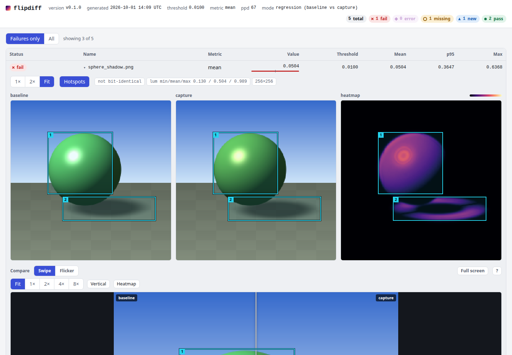

# saccade

saccade checks whether image captures and timings are good enough to support
a claim about a change. `compare` measures image changes, `prove` checks exact image identity
or performance claims, and `review` prepares a decision for a human. Captures
are paired by name and scored with NVIDIA FLIP. Each run writes an offline HTML
report and JSON evidence. Baselines change only when a human approves.



## Install

Each release has four archives and a `SHA256SUMS` file:
`saccade-x86_64-unknown-linux-gnu.tar.gz`, `saccade-aarch64-unknown-linux-gnu.tar.gz`,
`saccade-aarch64-apple-darwin.tar.gz` and `saccade-x86_64-pc-windows-msvc.zip`.
Download the one for your system from
[Releases](https://github.com/Tavrin/saccade/releases), check it, extract it,
and put `saccade` on your PATH:

```sh
sha256sum -c SHA256SUMS --ignore-missing
tar -xzf saccade-x86_64-unknown-linux-gnu.tar.gz
```

On macOS use `shasum -a 256 -c SHA256SUMS --ignore-missing`.
No Rust toolchain is needed. Each archive includes the licences and
third-party notices. See [releasing](docs/releasing.md) for how releases are
built and checked.

To build from source with Cargo (Rust 1.88 or newer):

```sh
cargo install --locked --git https://github.com/Tavrin/saccade saccade
```

From a clone, `cargo install --locked --path crates/saccade` does the same.
Add `--features prechecks` for the experimental safety and accessibility checks.

Check the install with `saccade --version` or `saccade doctor --json`.

## Quickstart (60 seconds)

```sh
saccade demo --out saccade-demo
saccade view saccade-demo
```

The demo writes three reports and exits with status 1 on purpose, because it
includes a moved shadow, a changed UI label and a missing capture. `view`
prints the page to open, `saccade-demo/report/index.html`. To compare your own
images:

```sh
saccade compare BASELINE_DIR CAPTURE_DIR --out report
saccade prove identity PARENT_DIR CANDIDATE_DIR --out proof
```

Exit status 0 means no image regression, 1 means at least one image failed,
and 2 means the command could not run. The result is in `report/index.html`.
saccade does not use the network, a GPU or an account for any of this.

## Compare files or directories

```sh
saccade compare examples/baseline/sphere_shadow.png examples/capture/sphere_shadow.png --out file-report
saccade compare examples/baseline examples/capture --out directory-report --json
saccade inspect directory-report/saccade-report.v1.json --status fail,error,missing,new --limit 5 --json
saccade inspect evidence directory-report/saccade-report.v1.json --entry sphere_shadow.png --out evidence-pack
saccade inspect export directory-report/saccade-report.v1.json --format png --entry sphere_shadow.png --out shadow.png
```

Both comparisons exit 1 because the example captures differ. The inspect and
export commands exit 0 when they finish. The default metric is mean FLIP, the
threshold is 0.01, and the viewing setting is 67 pixels per degree. Passing the
threshold only means the configured criteria were met. It does not mean nobody
would notice the change, or that the renderer is correct.

Measurement settings, regions, masks, capture requirements and declared changes
go in `saccade.toml`. Options given on the command line override the project
values. `inspect config` shows the effective settings and where each came from.

```sh
saccade init --template renderer --dir capture-project
saccade inspect config --config capture-project/saccade.toml --entry scene.png --json
```

Images are paired by relative name, and new or missing images fail by
default. A comparison with no images proves nothing. If captures carry
metadata, saccade can refuse to compare images made under different settings;
without metadata, comparability is left as unknown.
See [capture configuration](docs/captures.md).

## Optimization identity

This uses the demo from the quickstart:

```sh
saccade identity saccade-demo/identity/baseline saccade-demo/identity/capture --out identity-report --json
```

Exit 0 establishes exact native decoded-sample equality for the selected
images. The demo's PNG files have different bytes but equal samples. The
dimensions, sample type and channel interpretation must match, and every
selected pair must exist and decode. Perceptual tolerances, masks and
region-only acceptance are not accepted as proof of identity.

The proof only covers the captures supplied and the entries selected. Without
capture metadata, saccade can still show that the samples are equal, but
whether the captures are comparable stays unknown. Identical images on their
own do not show that anything got faster.
See [identity and performance](docs/identity-and-performance.md).

## Optional model review (bring your own key)

Start with a local preview. These commands do not call a provider:

```sh
saccade review directory-report/saccade-report.v1.json --out review-plan --json
saccade review request file-report/saccade-report.v1.json --question triage.route.v1 --out triage-request.json
saccade review ask triage-request.json --out human-review
```

The preview writes the exact payloads to `review-plan/requests.json`, with
estimated tokens and, if you configure model rates, an estimated cost.
The request uses the file report because every image in it is paired; a
question cannot be created while required facts are missing. Each request
identifies the exact evidence it refers to. `review propose` checks answers
against a request and records them as advice. It cannot approve anything.

To call a provider, you configure the endpoints and dedicated credentials in
your user configuration, allow egress for the source roots, and run
`review REPORT --run --budget-calls N` yourself. Egress is denied for any root
you have not classified. A project's files can pick from approved models and
lower budgets, but cannot grant network, credential, path or approval
authority. Retries and fallbacks all spend from the same attempt budget.
See [review](docs/review.md) for the workflow and limits.

## GitHub Action

```yaml
- uses: Tavrin/saccade@v1
  with:
    baseline-dir: tests/baseline
    capture-dir: artifacts/captures
```

The `v1` tag has not been published yet; the snippet shows the intended
syntax. By default the action installs a release binary and verifies its
checksum. Set `install-mode: source` to build from source instead. The report
and JUnit results are uploaded even when the comparison fails. Comparisons on
fork pull requests need only read permission and no AI keys.

The verdict, exit code, report URL and immutable artifact ID are separate
outputs. Baseline updates run only from a trusted dispatch tied to the selected,
reviewed content, and open a pull request for review that is never merged
automatically.
See [CI](docs/ci.md) and [Action examples](examples/action/README.md).

## For AI agents

Start with the [agent guide](docs/agents.md). It explains the bounded JSON
results (`verdict`, `worst`, `next_actions`), how to page through failures,
and what an agent may not do. Ready-made packs are generated from
[one guide](integrations/agent-guide.md): a
[Claude Code skill](integrations/claude-code/skills/saccade/SKILL.md) and
[Codex instructions](integrations/codex/AGENTS.saccade.md).

```sh
saccade mcp --root examples --out-root agent-reports
```

The MCP server has six tools. It reads only from the `--root` directories
(read-only) and writes only under `--out-root`. Provider calls stay off unless a
human starts the server with `--allow-provider-calls` and a positive
`--budget-calls`. None of the tools writes baselines. Agents must not relax a
threshold or update a baseline to make a task pass.

## Reproducible showcases

<!-- showcase-count:start -->
[9 reproducible cases](showcases/README.md) with commands, expected exits and measured output.
[Pages gallery](https://tavrin.github.io/saccade/showcase/).
<!-- showcase-count:end -->

The datasets are procedural, and simulated timings are labeled illustrative.
Generating them needs Python 3, Pillow and numpy, but no network, GPU or
provider. Validating the showcases needs a build with `--features prechecks`:

```sh
cargo build --release --locked -p saccade --features prechecks
scripts/run-showcases.sh
python3 docs/showcase/build.py --saccade target/release/saccade --out target/pages/showcase
```

Put the built binary on PATH before running the showcase script. The script
checks exit codes and compares output against the measured `EXPECTED.txt`
transcripts. It never accepts changed output on its own.

## Status

saccade 0.1.2 fixes the case-sensitive MCP Registry namespace.

- Stable: `compare`, `identity`, `approve`, `view`, `inspect`, `init`,
  `noise`, `demo`, `serve`, the local `review` preview and request commands,
  the MCP server, the HTML and JSON reports, exit codes, and the GitHub Action
  inputs. The active formats are listed in [contracts](docs/contracts.md).
  Scripts should gate on `doctor --json` capability names
  ([list](docs/contracts.md#build-identity-and-behavior-capabilities)).
- Experimental, and their output may change: the `experiment` commands
  (ablation, sequences, ranking, bisection, and the safety and accessibility
  prechecks) and `review eval`.
- AI review accuracy is not yet qualified. The pilot evaluation has fewer
  labeled cases per question than qualification requires, so we make no claim
  about how accurate any model's answers are, or which model does better.
  Treat every model answer as a proposal for a human to check.
  See [evaluation](docs/evaluation.md).

Local tests do not cover native installation on each platform or the behaviour
of live providers; those need their own checks.

## Limits

saccade only measures the captures it is given. It does not run your renderer
or schedule captures, it cannot tell when your application is ready to be
captured, and it does not treat equal images as proof of correct output. FLIP
scores depend on viewing conditions, and HDR display transforms and numerical
buffers have to be interpreted explicitly. When repeat noise is missing it is
treated as unknown rather than zero. A performance claim needs qualified
timing, repeat noise and attribution.

A model cannot establish equality, qualify timing, approve a baseline, or turn
a tie into an acceptance. If a model's answers contradict each other across the
two blind orderings, or the intent is ambiguous, the item stays unresolved. For
an independent blind review, the reviewer must not have the mapping or the
implementation context; whoever created the private key cannot review blind.

"Human-final" approval is a policy and an audit record. It does not
authenticate anyone: a shell agent with unrestricted access can still run
`saccade approve`. Workbench receipts
record a scoped token attestation; CLI receipts record `human_attestation: null`.

## Documentation

- [Captures](docs/captures.md) and [identity/performance](docs/identity-and-performance.md)
- [Review](docs/review.md), [agents](docs/agents.md), [CI](docs/ci.md)
- [Exclusion audits, performance onset, geometry and motion](docs/wave1.md)
- [Contracts and generated schema index](docs/contracts.md)
- [Evaluation](docs/evaluation.md), [command reference](docs/cli.md), [experimental checks](docs/experimental.md)
- [Architecture](docs/design.md), [contributing](CONTRIBUTING.md), [changes](CHANGELOG.md)

## License

saccade is licensed under either of [MIT](LICENSE-MIT) or
[Apache-2.0](LICENSE-APACHE), at your option. FLIP comes from the pure-Rust
[flip-rs](https://crates.io/crates/flip-rs) port of NVIDIA FLIP, which is
BSD-3-Clause. See [third-party notices](THIRD_PARTY.md); release archives
also carry a generated `THIRD_PARTY_NOTICES.md` covering every dependency.

MCP Registry name: `mcp-name: io.github.Tavrin/saccade`
